# Lab 1 - Introduction to the environment

## **Objectives**

This is a read-only lab there are no configuration tasks you need to accomplish. Upon completion of this lab you will be able to:

- Understand the Webex AI Agent Architecture
- Describe the Webex AI Agent Components for CCE
- Understand the Webex AI Agent Call Flow
- Know how to access the components used to deliver this lab and how to access each part.

**Expected Total Time - 15 minutes**

## **Task 1. Introduction to Webex AI Agent**

Webex AI Agent refers to an artificial intelligence virtual agent integrated into Cisco WebexCCE or CCE. These AI Agents are designed to enhance customer service and support by automating interactions, assisting human agents, and providing analytics-driven insights.

### **Webex Agent AI Architecture**

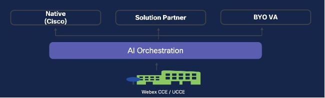

**Native:** Cisco's in-house solution for Virtual Agent. This is the type of Virtual agent that you will configure in this lab.

**BYO VA:** Bring your own Virtual Agent. (Not currently supported, will be offered at a later time)

### **Webex Agent AI Components**

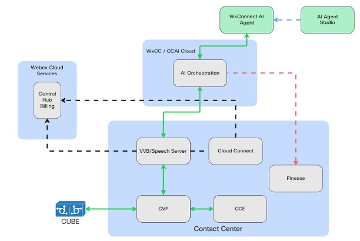

In both the CCE on-premises solution and the Webex CCE tenant, several key components are integral to the Webex AI Agent solution. These include Cisco Unified Voice Portal (CVP), CVP Call Studio, VVB/Speech Server, the CCE core, and Cloud Connect. On the cloud side, the main components consist of Cisco Webex Cloud Services (such as Control Hub, Billing, etc.), AI Orchestration services, the Webex Connect AI Agent, and the AI Agent Studio.

**CVP:** Enables automated customer self-service and call routing, acting as an Interactive Voice Response (IVR) system integrated with CCE / WxCCE. It works with the VVB and Speech Server to provide AI Agent integration in the IVR flow.  

**CVP Call Studio:** CVP Call Studio is a development platform for creating voice applications.

**VVB/Speech Server:**  is designed to facilitate concurrent multimedia or IVR communication processing. The speech Server communicates the request from customer/caller to the AI orchestration services using gRPC.

**CCE Core:** Peripheral Gateways, the Router, Admin Workstation, and other CCE components work together to process incoming requests and determine the most suitable destination to handle them. The Admin Workstation (AW) is where you configure and manage the overall CCE solution..

**Control Hub:** Control Hub serves as the central platform for managing and configuring Webex cloud solutions. From Control Hub, you can also provision and directly launch the AI Agent Studio.

**AI Orchestration:** Refers to Cisco's cloud-based services that handle incoming requests from customers through the WxCCE or CCE solution, then route those requests via a Cisco Connector to the Webex Connect AI Agent.

**AI Agent Studio:** AI Agent Studio helps to create the necessary workflows for Scripted AI Agent

There are two kinds of AI Agents:

- Scripted Agent: Works on Predefined Intents, Entities and training data backed with a NLP Engine.

- Autonomous Agent: Works on Tools / Skills and Knowledge Based powered by a Large Language Model (LLM).

More Information on:
[Webex AI Agent Studio Administration guide](https://help.webex.com/en-us/article/ncs9r37/Webex-AI-Agent-Studio-Administration-guide){:target="_blank"}

## **Task 2. Webex AI Agent Call Flow**

Review the flow diagram below for the details of how the components communicate.


1. At start up, VVB/Speech Server requests a token to Cloud Connect in order to authenticate with Webex Services and AI Orchestration.
2. Customers place a call.
3. Call is sent to CVP (Call control and IVR treatment) from Cisco Unified Border Element (CUBE).
4. CVP sends the call to CCE and receives the instructions to send the call to VVB for IVR Treatment.
5. VVB sends the request to Speech Server for further processing - connect the call to the virtual Agent (AI Agent).
6. Speech Server sends AI Agent Id and Event to the AI Orchestrator.
7. AI Orchestrator provides the session information (URI) of the AI Agent.
8. Speech Server creates a new session with Webex Connect and passes the welcome event which is configured in VAV element in CVP call studio.
9. Call is connected between the Caller and the AI Agent via the VVB/Speech Server.

## **Task 3. Review of the Lab**

In this task, we will log in to the components that are used in this lab. The goal is to understand where we need to go to configure, maintain, and troubleshoot these features.

**Step 1. Access dCloud systems**

Follow the steps in the *Credentials* tab to access the dCloud eXpo session. Once you are logged into WKST1, locate the mRemoteNG icon and double-click to open.


We will use the CVP and AW-HDS-DDS machines in this lab. You do not need to access them yet, just make a note of where they are.

**Step 2. Access Control Hub**

Open a web browser to the [Webex Control URL](https://admin.webex.com){:target="_blank"}. Refer to the *Credentials* tab for details for the credentials to use. The Overview page should load as shown in the screenshot.

Under the **Services** section, select **Contact Center**.

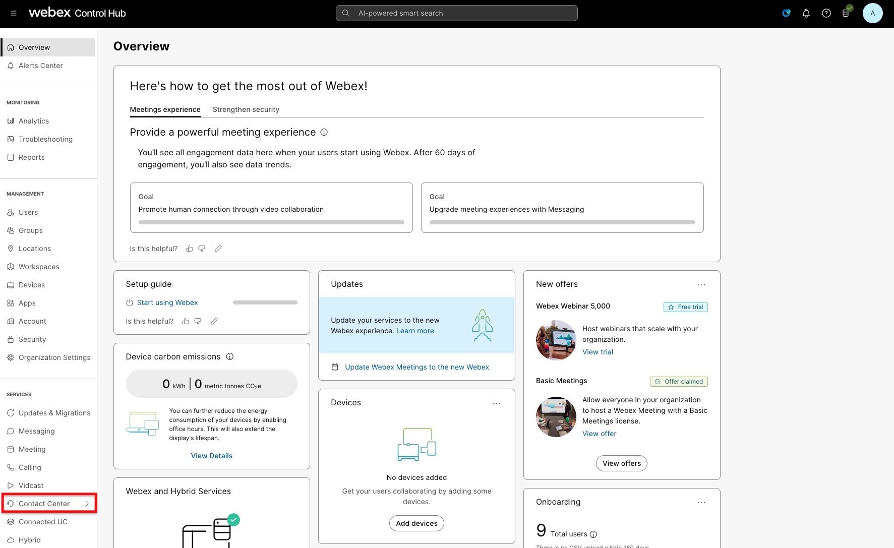

Review the items in this section.

**AI Agent** - This new section has been added to access the Webex AI Studio. This provides a link to the environment where you will build and maintain your Native AI Bots.

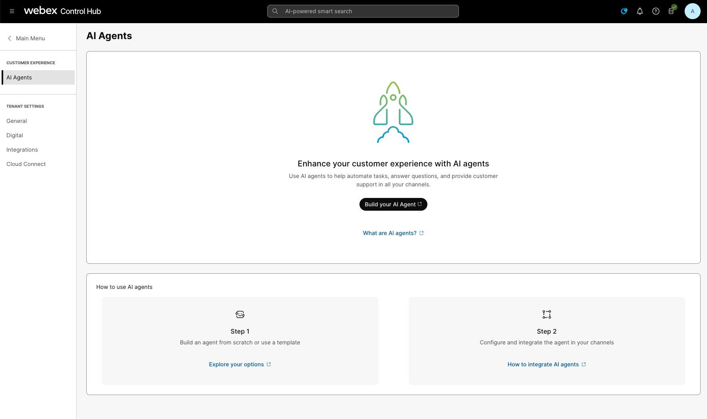

**General** – This shows the country where the tenant is created and the Timezone selected. You can also find a link to access Webex Engage.

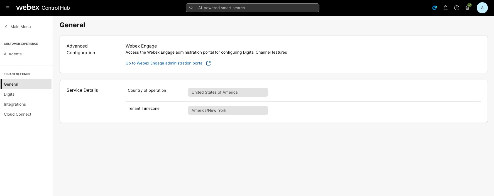

**Digital** – This menu is where you can upload the public key certificate to decrypt the SAML assertion. You can access both Webex Connect and Webex Engage from this menu.

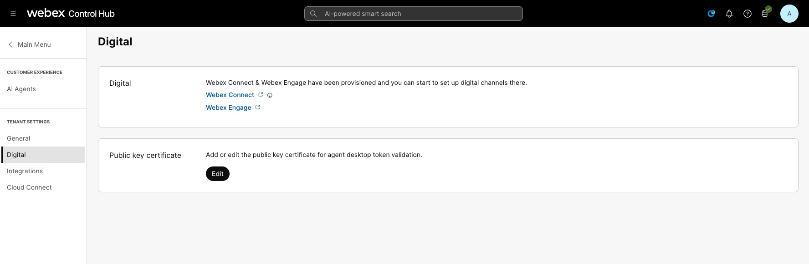

**Integrations** – This section is shown only for the AI Trials as the CCAI entitlement is required. It is expected that this will not be shown once this feature is launched.

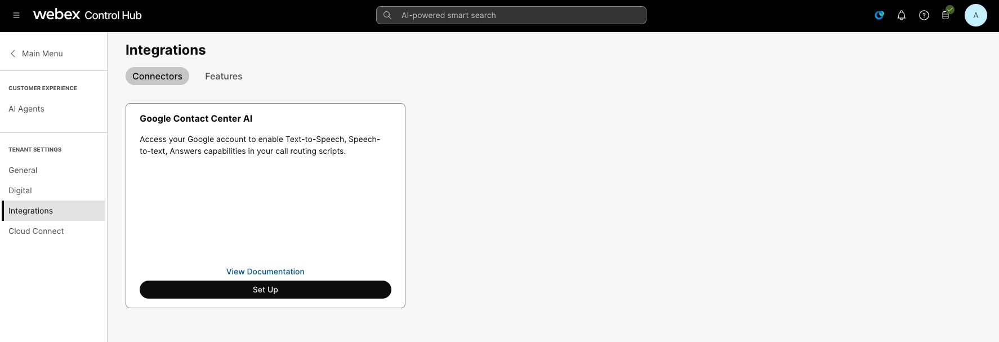

**Cloud Connect** – This menu is where you would add the Cloud Connect server to the tenant. Since we have shared tenants, this part needed to be done ahead of time. *Please DO NOT change any information shown in this section.**

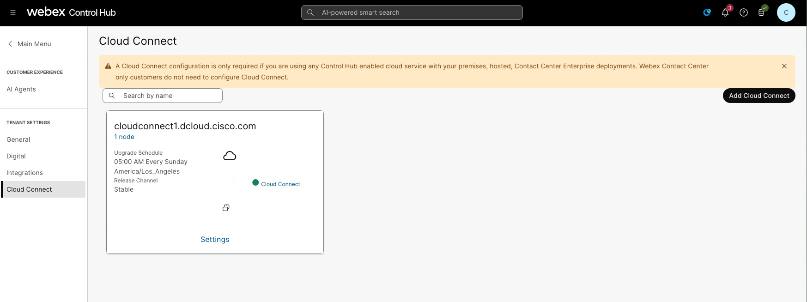

**Step 3. Access AI Agent Studio**

Navigate to the AI Agents section of Control Hub. Select the link, *What are AI Agents?*. Notice that this opens a new tab and directs you to the documentation. As you navigate this section, you can refer to the official documentation at any time.

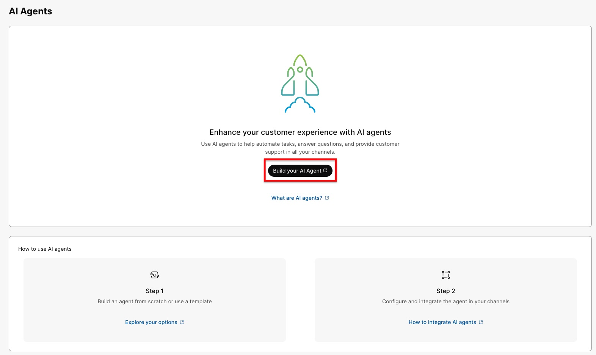

Select the *Build your AI Agent* button. This will open a new tab to the Webex AI Agent Studio. You will see that there is one Scripted AI Agent template there, this is simply a placeholder. You will build your own AI Agent in the coming labs.

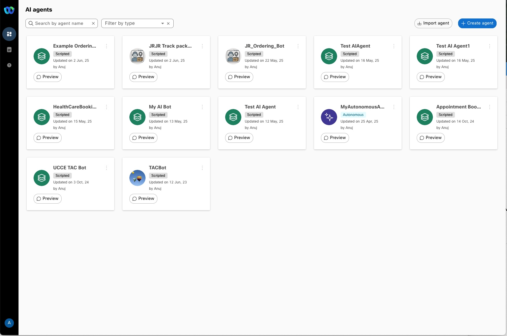

Next, select the second icon in the black menu bar on the left. This opens the Knowledge base management section. To save time in the class, we have created Knowledge Bases for each seat.

Finally, select the third icon down. This opens a tab to the documentation for the Webex AI Agent Studio.

**Step 4: Access CVP Call Studio**

In the dCloud Workstation 1 machine you opened in step 1, log in to the CVP server in mRemoteNG.

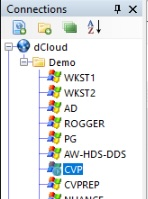

After you have logged in, locate and open *Cisco Unified Call Studio*.


We will eventually build the CVP Application here. For now, familiarize yourself with where Studio is located.

**Step 5. Finesse Agent Desktop**

On your WKST1 open the browser of your choice. copy the Finesse URL below and paste it in to the URL field of the browser.

```
https://finesse1.dcloud.cisco.com/desktop
```

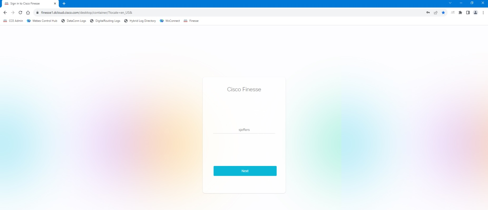

Log in as agent, Sandra Jeffers (sjeffers) with extension 1080. Note that Sandra is a single sign-on agent, so you may see a redirect to the ADFS screen. The username and password should be saved. If the password is missing, refer to the *Credentials* tab.

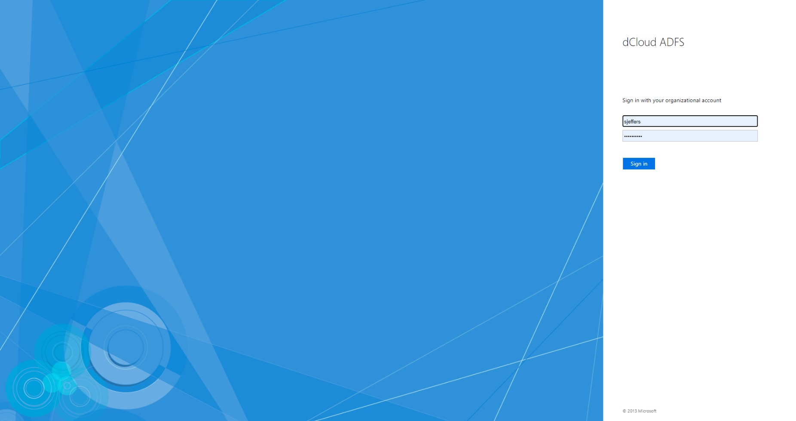

When prompted, enter extension 1080, then select Submit.

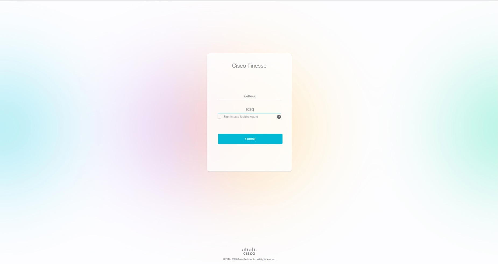

When you have logged in, you will see a new icon at the top of the screen that appears to be a blue circle. This is the new Webex AI Assistant. We will see this later in this class. If you select the Agent Answers option in the left-side, black bar, you will see the Transcript feature. This will show the interaction that occurred between the customer and the Webex AI bot. We will see this feature later in this class.
