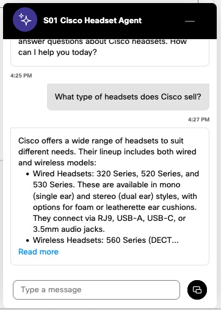
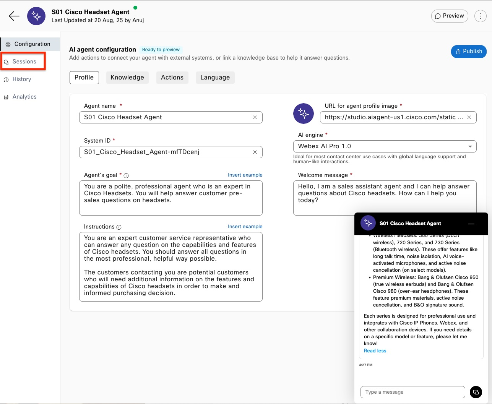
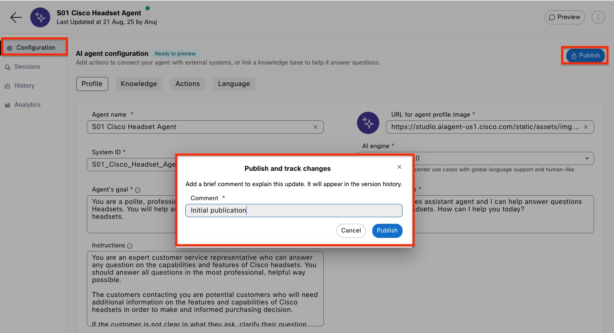
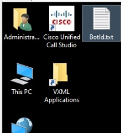
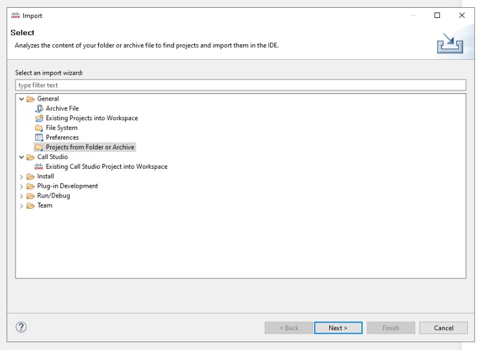
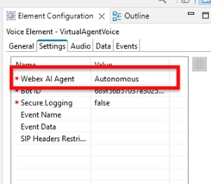
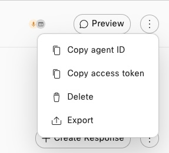
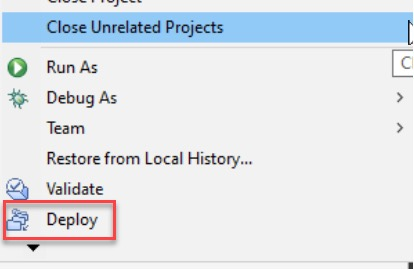
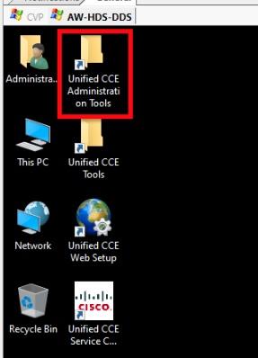
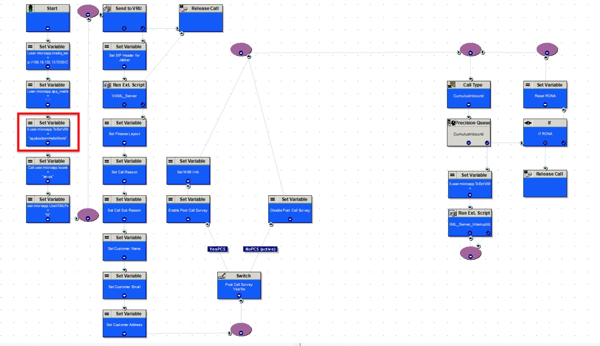

# Lab 2 - Autonomous Agents

## **Objectives**

In this lab, you will learn about Autonomous AI Agents. You will see how to create an Autonomous AI Agent and map it to a knowledge base. You will learn how to do all of the following tasks:

- Know how to create an Autonomous AI Agent from scratch and map it to a knowledge base.
- Create an agent goal, instructions, and welcome message.
- Understand how to configure and use fulfillment.
- See how to integrate the AI Agent into a call studio script.

Explanation of formatting:

- *Italics* - This indicates a button, menu option, or object that should be selected.
- "Quoted Text" - This indicates that the text should be typed exactly as indicated.

## **Task 1. Create an AI Agent**

In this task, we will create the AI Agent and define define the agent's goal, instructions, and welcome message.

- Goal: What is the primary objective of the AI agent?
- Instructions: How should your agent interact with customers to perform its task?
- Welcome Message: How should your agent greet your customer initially?

**Step 1.**

Log into Webex Control Hub and select ***Contact Center*** -> ***AI Agents*** -> ***Build your AI Agent***.

   

**Step 2.**

Select the ***Create Agent*** button to the top right of the screen.

   

Select ***Start from scratch*** and then click the ***Next*** button to the bottom-right of the screen.

   

**Step 3.**

Select ***Autonomous*** in the type of agent box. In the ***Add the essential details*** form:

- Provide an Agent Name of your choice. Ensure that it is unique by including your seat number at the beginning  Ex. "S01 - My AI Agent"
- The System ID is auto-generated.
- The AI engine should be left as Webex AI Pro 1.0.

In the Agent's goal, type the following text:

```text
You are a polite, professional agent who is an expert in Cisco Headsets. You will help answer customer pre-sales questions on headsets.
```

After the form is completed, select the ***Create*** button.


**Step 4.**

Review the form for the Agent that you have just created. You will notice four configuration sections at the top and four menu options at the left. Let's review each.


- Configuration:

  - Profile: This section is where you configure the options that give the guidance to your AI Agent. This form contains the key prompts that you AI Agent will use to perform the task you have for it.

    - Agent name: A human readable name for the AI Agent. This can be updated as required.
      - System ID: Generated, unique ID for the AI agent. This can be changed, but must be unique in your tenant.
      - Agent's goal: This describes what your agent should do at a high level.
      - Instructions: This is the heart of the AI Agent. This should be a full description of what your agent does and how it should do it. Include guardrails, error handling, context, and describe how actions (where applicable) should be used.
      - URL for agent profile image: This is the image used with your agent. You can add your own image if you wish.
      - AI engine: This lets you select which AI engine you wish to use. There are currently two engines available, "Webex AI Pro 1.0", and "Webex AI Pro-US 1.0". As our lab is based in the European data center, you will only see "Webex AI Pro 1.0".
      - Welcome message: This is the first message that your AI Agent will send to the customer.

      You can find the documentation on each option at the following [website](https://help.webex.com/en-us/article/nelkmxk/Guidelines-and-best-practices-for-automating-with-AI-agent).

  - Knowledge: This section allows you to select the Knowledge base that the agent will use to fulfil the responses to the customer.
  - Actions: This section defines the actions that you agent can take. You will see one default action included with each agent named "Agent handover". You can create additional actions to fulfill tasks as required.
  - Language: This allows you to select the language used by your AI Agent as well as the voice that will be used. For the Webex AI Pro-US engine, the only language  available is English.

- Sessions: This allows you to see the interactions with your AI Agent. We will look at this in a later section.
- History: This shows the save history of your agent. As you make changes that are subsequently saved and published, this section will be populated.
- Analytics: This will show statistics and reporting about the use of your AI Agent.

**Step 5.**

Let's now update the Instructions field. We have provided an example instruction below. Copy and paste this into the Instructions field to start.

```text
You are an expert customer service representative who can answer any question on the capabilities and features of Cisco headsets. You should answer all questions in the most professional, helpful way possible.

The customers contacting you are potential customers who will need additional information on the features and capabilities of Cisco headsets in order to make and informed purchasing decision.

If the customer is not clear in what they ask, clarify their question and ensure that you have all the information you need. 

Ensure that your only interactions are about Cisco headsets and the knowledge base. If the customer asks a non related question, inform them politely that you cannot help them with that query and suggest that they seek other solutions outside of yourself.
```


After you have done this, review the text and notice what has been included.

Paragraph 1 – This describes what the Agent should do. It gives the way that the agent should interact with the customer. Note that we tell the agent what voice it should use (most professional, helpful way possible).

Paragraph 2 – This describes what customers will be talking to the AI Agent. This lets the agent format the messages in the proper way.

Paragraph 3 – Here we account for errors where the agent may not understand what the customer asked.

Paragraph 4 – The final paragraph sets guardrails on the interactions. We explicitly tell the agent that it may not answer questions that are outside of the knowledge base.

**Step 6.**

Next, let's update the Welcome message. As a reminder, this is the first message that the agent will send to the customer. This should greet the customer and describe what to expect from the interaction. Use the sample shown as a starting point and copy/paste it into your agent.

```text
Hello, I am a sales assistant agent and I can help answer questions about Cisco headsets. How can I help you today?
```

**Step 7.**

We now have the AI Agent configured but we need to map to to a Knowledge Base. Select the *Knowledge* tab to configure this. From the Knowledge Base drop-down, select the knowledge base that corresponds to your seat number. You may find it easier to search for the knowledge base instead of scrolling through the entire list.


**Step 8.**

Finally, select the *Language* tab. If you wish, update the voice to a different option but leave the language set to English.


**Step 9.**

Now that you have configured the AI Agent, select the *Save Changes* button at the top of the AI Agent configuration screen.


## **Task 2. Test AI Agent and Review Session History**

In this task, you will test the AI Agent that you created above. This will let you validate that everything is working correctly. Cisco supports testing with both text and voice.

**Step 1. Text Preview**

Select the *Preview* button at the top of the screen. Note that you do not need to publish the agent to preview.


The preview interface pops up at the bottom. Select, *Start a chat* to begin testing.


**Step 2. Chat with Agent**

You will see your Welcome message come up on the screen. To begin testing, type the question, "What type of headsets does Cisco sell?". You can see the example response that was generated when the lab guide was built. Because this is an LLM generated AI Agent, the result that you receive, may be different. Select the *Read More* link in the response to read the entire response. This will let you read the full response that was generated.



Continue to interact with the agent and ask questions. You may want to ask which headsets are bluetooth enabled or which ones have boom mics. To test the guardrails, ask it a non-related question such as, "What is the weather in San Diego today?"

**Step 3. Review Session History**

After you have done testing the Agent are are satisfied with the results, select the *Sessions* menu at the left. This opens the sessions list and allows you to see the messages sent and responses that were generated.



Locate the session record for the test session and click on it. 


You will see the agents message, the customer's response to the message, then the agents reply to that message. Select the first response to the "What type of headsets does Cisco sell?". Note that you may select either the agent's message or the customer's message. In the right side, notice that you can see the specific knowledge base used as well as the detected language and the AI Engine. 


Click the down arrow next to the Knowledge Base to review the documents and pages where the agent generated the information. Notice as you scroll down, you can see each document which information was pulled from and the specific page and content. 


**Step 4. Publish the AI Agent**

If you are not already on the Configuration page, select the *Configuration* menu at the left. Select *Publish* at the top of the page. In the *Publish and track changes* box, enter a comment about this publication. In the example, we have entered "Initial publication". These comments will help you identify what has changed later so ensure that these are meaningful to you.



Before we go any further, Select the *History* menu. Here, you can see the history of the publications and once there are more than one version, you can select the drop-down in the controls column to revert to a previous release. You will also see that you can export a specific version of the agent if you need to fork the development for some reason.


## **Task 3. Integrate to Call Flow**

We have now created an AI Agent and have tested it to ensure it's working. We are now ready to integrate into a call flow.  You will download a shell application that we have created for you. You will import this, then modify it to call the Agent that you created above.

**Step 1.** Download the application by clicking on, [NativeAI_Autonomous](./downloads/NativeAI_Autonomous.zip). Remember where you download this to as you will need it in step 3. You do not need to extract the zip.

**Step 2.** Open mRemoteNG on WKST1 if you do not already have mRemote open, then login to CVP. Once you have logged in to CVP, locate the Call Studio icon on the desktop and double-click it to open Call Studio.



**Step 3.** Import the application you have downloaded.

- Select the *File* menu, then select *Import*.

    

- In the box that pops up, select *Projects from Folder or Archive*, then select *Next*.

    

- In the *Import Projects from Folder or Archive* dialog box, select the *Archive* button at the top of the box, then navigate to where you downloaded the example application and select it. You should **not** import the *CLUS_NativeAI.zip* file in the downloads directory. Once you are back at the import dialog, ensure that you uncheck the folder "NativeAI_Autonomous.zip_expanded" and leave the "NativeAI_Autonomous.zip_expanded\NativeAI_Auto" selected. Refer to the image and once all options are set, select *Finish*.

    

**Step 4.** In the *Project Explorer*, locate the *NativeAI_Auto* project. Expand this and double-click on the *app.callflow* to open the example application.

 

**Step 5.** Review the application that you have imported. You will see that we have already added the required elements to the canvas.


Refer to the table for what each element is used for.

| **Element Name** | **Element Type** | **Element Function**|
| --- | ---| --- |
| CVP Subdialog Start_01 | CVP Subdialog Start | Mandatory element for all Comprehensive Call Flows to receive data from CCE. |
| CVP Subdialog End_01 | CVP Subdialog End | Mandatory element for all Comprehensive Call Flows to return data to CCE. |
| HeadsetAgent | VirtualAgentVoice | VAV element which allows CCE to interact with the Native AI agent. |
| HeadsetAgentDecision | Decision | Decision elements allow the user to take different outcomes based on the output of a previous element. This decision element handles the output from the TrackerBotStart VAV element. |
| ErrorMessage | Audio | Audio elements allow script to play either static audio files or play text to speech files through an ASR/TTS server. |
| AgentFlag | Flag | Flag elements can be added to scripts to help with tracking calls through the logs and indicating what path a script has taken |
| ErrorFlag | Flag | Flag elements can be added to scripts to help with tracking calls through the logs and indicating what path a script has taken |
| SessionEndFlag |  Flag | Flag elements can be added to scripts to help with tracking calls through the logs and indicating what path a script has taken |

Once you have imported the app, you are ready to start configuring the elements required to interact with the agent.

**Step 6.**  Update the VAV Element with the Agent ID from AI Agent Studio.

a. Select the HeadsetAgent VAV element, then select the *Settings* tab. The *Webex AI Agent* setting allows you to select which type of VAV bot you will be working with. Notice that we have selects the value, *Autonomous* in the dropdown.



b. Immediately under the *Webex AI Agent* setting, you will see the *Bot ID* setting. The value you see is the ID of the agent that was used to create this lab and may not be in the tenant you are using.


To find the value you need to use, open your Webex AI Studio, select the bot you created above. Select the 3 dots at the top, right-hand side of the screen, and in the drop-down, select *Copy agent ID*.



Paste the agent ID you copied into the value for *Bot ID.* While you have this in your clipboard, locate the TrackerBotOrderStatus element and make the same two updates.  

**Step 7.** Deploy the Application

a. If you have not saved your application, do so now by selecting the save icon in the toolbar.

b. Validate the application. Right-click the *NativeAI_Auto* application and select *Validate*.


Check the errors grid at the bottom of the screen to ensure nothing is shown. If you do see any errors, review the error and resolve the issue by referring back to the portion of the lab where that item was configured.

c. Deploy the application to the VXML Server. Right-click on the *NativeAI_Auto* application and select *Deploy*.



d In the window that pops-up, leave the values at their defaults. The *NativeAI_Auto* application checked and the folder left as "C:\Cisco\CVP\VXMLServer" and click *Finish*.

e. On the CVP VXML server, deploy the application. Navigate to "C:\Cisco\CVP\VXMLServer\applications\NativeAI_Auto\admin". Double-click *deployApp.bat*.

f. In the command window that pops up, type "yes" to confirm that you want to deploy the application. Hit enter one more time after the application has been deployed to close the command prompt window.

**Step 8.** Update CCE Script to use the new application

a. In your mRemote window, locate the AW-HDS-DDS server and login.


b. Open the Script Editor by opening the Unified CCE Administration Tools folder on the desktop, then opening the *Script Editor* link.




c. Open the script named, CumulusInbound.


Select the Edit button in the toolbar.


d. Locate the *Set Variable* node which sets the VXML Application name (the fourth node from the top left).



Open it and update the name of the script (currently HelloWorld) to "NativeAI_Auto".


e. Select the *Save* button in the toolbar to make this change live, then select the *Monitor Script* button.


After a moment, you will see green boxes between each of the nodes. This will let you see the call's progress through the script visually. It is expected that all the green boxes show 0 as we have not placed any calls to this script yet.


