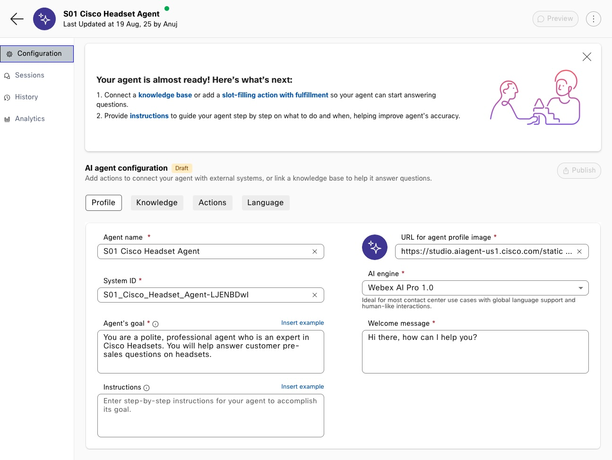

# Lab 2 - Autonomous Agents

## **Objectives**

In this lab, you will learn about Autonomous AI Agents. You will see how to create an Autonomous AI Agent and map it to a knowledge base. You will learn how to do all of the following tasks:

- Know how to create an Autonomous AI Agent from scratch and map it to a knowledge base.
- Create an agent goal, instructions, and welcome message.
- Understand how to configure and use fulfillment.
- See how to integrate the AI Agent into a call studio script.

Explanation of formatting:

- *Italics* - This indicates a button, menu option, or object that should be selected.
- "Quoted Text" - This indicates that the text should be typed exactly as indicated.

## **Task 1. Create an AI Agent**

In this task, we will create the AI Agent and define define the agent's goal, instructions, and welcome message.

- Goal: What is the primary objective of the AI agent?
- Instructions: How should your agent interact with customers to perform its task?
- Welcome Message: How should your agent greet your customer initially?

**Step 1.**

Log into Webex Control Hub and select ***Contact Center*** -> ***AI Agents*** -> ***Build your AI Agent***.

   

**Step 2.**

Select the ***Create Agent*** button to the top right of the screen.

   

Select ***Start from scratch*** and then click the ***Next*** button to the bottom-right of the screen.

   

**Step 3.**

Select ***Autonomous*** in the type of agent box. In the ***Add the essential details*** form:

- Provide an Agent Name of your choice. Ensure that it is unique by including your seat number at the beginning  Ex. "S01 - My AI Agent"
- The System ID is auto-generated.
- The AI engine should be left as Webex AI Pro 1.0.

In the Agent's goal, type the following text:

```text
 You are a polite, professional agent who is an expert in Cisco Headsets. You will help answer customer pre-sales questions on headsets.
 ```

After the form is completed, select the ***Create*** button.


**Step 4.**

Review the form for the Agent that you have just created. You will notice four configuration sections at the top and four menu options at the left. Let's review each.



- Configuration:

  - Profile: This section is where you configure the options that give the guidance to your AI Agent. This form contains the key prompts that you AI Agent will use to perform the task you have for it.

    - Agent name: A human readable name for the AI Agent. This can be updated as required.
      - System ID: Generated, unique ID for the AI agent. This can be changed, but must be unique in your tenant.
      - Agent's goal: This describes what your agent should do at a high level.
      - Instructions: This is the heart of the AI Agent. This should be a full description of what your agent does and how it should do it. Include guardrails, error handling, context, and describe how actions (where applicable) should be used.
      - URL for agent profile image: This is the image used with your bot. You can add your own image if you wish.
      - AI engine: This lets you select which AI engine you wish to use. There are currently two engines available, "Webex AI Pro 1.0", and "Webex AI Pro-US 1.0". As our lab is based in the European data center, you will only see "Webex AI Pro 1.0".
      - Welcome message: This is the first message that your AI Agent will send to the customer.

      You can find the documentation on each option at the following [website](https://help.webex.com/en-us/article/nelkmxk/Guidelines-and-best-practices-for-automating-with-AI-agent).

  - Knowledge: This section allows you to select the Knowledge base that the agent will use to fulfil the responses to the customer.
  - Actions: This section defines the actions that you agent can take. You will see one default action included with each agent named "Agent handover". You can create additional actions to fulfill tasks as required.
  - Language: This allows you to select the language used by your AI Agent as well as the voice that will be used. For the Webex AI Pro-US engine, the only language  available is English.

- Sessions: This allows you to see the interactions with your AI Agent. We will look at this in a later section.
- History: This shows the save history of your agent. As you make changes that are subsequently saved and published, this section will be populated.
- Analytics: This will show statistics and reporting about the use of your AI Agent.

**Step 5.**

Let's now update the Instructions field. We have provided an example instruction below. Copy and paste this into the Instructions field to start.

```text
You are an expert customer service representative who can answer any question on the capabilities and features of Cisco headsets. You should answer all questions in the most professional, helpful way possible.

The customers contacting you are potential customers who will need additional information on the features and capabilities of Cisco headsets in order to make and informed purchasing decision.

If the customer is not clear in what they ask, clarify their question and ensure that you have all the information you need. 

Ensure that your only interactions are about Cisco headsets and the knowledge base. If the customer asks a non related question, inform them politely that you cannot help them with that query and suggest that they seek other solutions outside of yourself.
```


After you have done this, review the text and notice what has been included.

Paragraph 1 – This describes what the Agent should do. It gives the way that the agent should interact with the customer. Note that we tell the agent what voice it should use (most professional, helpful way possible).

Paragraph 2 – This describes what customers will be talking to the AI Agent. This lets the agent format the messages in the proper way.

Paragraph 3 – Here we account for errors where the agent may not understand what the customer asked.

Paragraph 4 – The final paragraph sets guardrails on the interactions. We explicitly tell the agent that it may not answer questions that are outside of the knowledge base.

**Step 6.**

Next, let's update the Welcome message. As a reminder, this is the first message that the agent will send to the customer. This should greet the customer and describe what to expect from the interaction. Use the sample shown as a starting point and copy/paste it into your agent.

```text
Hello, I am a sales assistant agent and I can help answer questions about Cisco headsets. How can I help you today?
```

**Step 7.**

We now have the AI Agent configured but we need to map to to a Knowledge Base. Select the *Knowledge* tab to configure this. From the Knowledge Base drop-down, select the knowledge base indicated by your lab instructor.