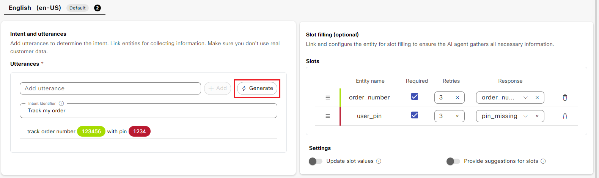
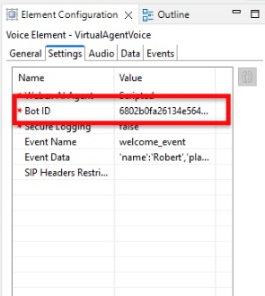

# Lab 3 - Import and Customize an AI Agent

## **Objectives**

In this lab you will build a Scripted AI agent that can respond to both chat and voice channels:

- Know how to import an exported agent
- Know how to create Intents, Entities, and Responses
- Know how to return data back to the calling application
- Know how to use previous interactions to troubleshoot intent and response mapping

This agent will collect the order number and a user PIN from the user, then pass that information back to the Call Studio application. The studio application will then call a RESTful API to get order status and return this status back to the AI Agent. The AI Agent will play the order status back to the customer.

Explanation of formatting:

- *Italics* – This indicates a button, menu option, or object that should be selected.
- "Quoted Text" – This indicates that the text should be typed exactly as indicated.

**Expected Total Time - 60 minutes**

Note, you will have about 60 minutes to complete this lab.

## **Task 1. Import and Customize an Agent**

In this task, we will import an agent that we have configured for you ahead of time. The full steps to configure a Scripted AI Agent would take more time than we have for this lab so we have simplified quite a bit.

**Step 1.** Download the example agent and import into AI Agent Studio

a. Select the [Scripted AI Agent](./downloads/OrderingAIAgent.zip) to download the AI Agent to your desktop. Once you have done this, extract the zip file so that you have the JSON file ready.

b. In AI Agent Studio, select the *Import agent* button at the top, right side of the studio.


c. Select the *Upload* button, then navigate to where you extracted the Agent and select it to import. Provide unique agent name. To do this, include your seat number in the format of, "S01 - My Order Fulfillment Agent". The System ID will be automatically generated, accept the default. After validating that everything is correct, select the *Import* button at the bottom, right of the page.


**Step 2.** Add Intent and Response to collect required information. Rather than have you create all the Intents and Responses, you will only create one sample Intent and its corresponding Response.

a. In the AI Agent configuration, navigate to ***Script*** -> ***Intents*** -> click on the ***Create intent*** button.


b. Enter the Intent name as "Start Order Tracking" and enable the toggle button to ***Reset slots after completion***.

c. Under the ***Intent and Utterances*** section, type the phrase, "Track my order" and click the ***Add*** button.


d. Next, add a 2nd utterance by typing "track order number 123456 with pin 1234" and clicking the ***Add*** button.

- As soon as the 2nd utterance is added, the 6 digit number and the 4 digit pin will be highlighted and previously created entities of "order_number" and "user_pin" are added under the ***Slot filling*** section.
- In the Slot filling section, check the ***Required*** box for each of these slots.

 

> What is an entity?
>> Entities are the building blocks of conversations. They are essential elements that the AI agent extracts from user utterances. Entities represent specific pieces of information, such as product names, dates, quantities, or any other significant group of words. By effectively identifying and extracting entities, the AI agent can better understand user intent and provide more accurate and relevant responses.

> What is a slot?
>> The value collected for an entity is called a slot. Consider the following analogy, entity is a variable name and slot is the value of that variable.

> Why do I need to create a slot here?
>> As part of the Intent, the agent needs to collect the basic info like order number and the user pin so that these 2 values can be passed to the API to look for the status of an order in the database.

e. Add the Response for missing order number by selecting the drop-down next to the order_number entity in the *Slot filling* section. In the search box, begin typing the phrase "order_number" and select the Custom response named, "order_number".


Repeat this for the user_pin entity. The response name you need to find is "pin_missing". Reference the image below for the completed Slot filling section.


f. On the "Start Order Tracking" Intent configuration page and under the ***Intent and utterances*** section, click on the ***Generate*** button.
 

g. In the ***Generate variants*** dialog box, provide a description as described below to generate relevant training data and utterances.
```
Generate prompts to track an order. Five of those prompts include a 6-digit order number. Another five of the prompts include a 6-digit order number and a 4-digit pin.

```

h. In the ***Number of variants*** enter 20 and set ***Creativity*** to High. Lastly, click the ***Generate*** button.


i. This is what your ***Intent and utterances*** configuration section should now look like. The ***order_number*** and ***user_pin*** slots should now be highlighted automatically. You can add more utterances if you like.

*Note: Hallucinations should be rare, but review the generated utterances to enure there are no hallucinations.*


You can also add an utterance as a Regular Expression (RegEx)

- track\*.\*order
- order\*.\*track


**Step 3.** Create Response to return data to Call Studio

a. In the ***Response*** section, select the drop down and click on ***Create new***.


b. In the ***Create a response*** pop up windows, enter the response name as ***track_order_wait*** and then select the + symbol and click on ***Voice*** to add Voice channel.

c. In the Text section, add the text below as ***Variant 1***. Feel free to add more of these variants if you like.

```
Please wait while I track your order.

```

d. Now, click on the ***Custom Event*** button to the right to create a custom event and enter as shown below:

- **Event name:** 
```
custom_event
```
- **Event payload:** 
```json
{
  "Execute_Request": {
    "Data": {
      "Params": {
        "order_number": "${entity.order_number}",
        "user_pin": "${entity.user_pin}"
      }
    },
    "Event_Name": "custom_event"
  }
}
```
e. Lastly, click ***Create*** and this will take you back to the "Start Order Tracking" Intent configuration page.


> Why do we need to add Custom Event here?
>> Custom Event is being added here to pass the order_number and user_pin entity data collected by the AI Agent, back to the Call Studio app. This is coming up in the next lab guide.

**Step 6.**
Verify that you've completed all of the required configurations as seen in the screenshot below and click ***Create***.


**Step 7.** Add Inbound Intents

a. In the AI Agent configuration, navigate to ***Script*** -> ***Responses*** -> click on the ***Welcome message*** response.

   

b. Next, select the Voice channel response located next to Default (web).

 

c. In the incoming event name, enter "welcome_event". Once you have done this, select the *Save* button at the bottom to return to the list of responses.


d. In the AI Agent configuration, navigate to ***Script*** -> ***Responses*** -> Click on the magnifying glass next to "Response Name" to search for a response. Type in the first few letters of, "track_order_results". Locate the Response in the list, and select it to edit it.


e. In the incoming event name, enter "track_order_results". Once you have done this, select the *Save* button at the bottom to return to the list of responses.


Why did we need to do this? When the AI Agent is called from Call Studio, we need to tell the Agent where it should start. This is what the incoming event name field allows us to do. When you see the Call Studio application in the steps below, notice that we have specified the welcome_event in the first node and the track_order_results in the second.

**Step 8.**

a. On the top right of the AI agent configuration dashboard, click on ***Save changes***.

 

b. Next, click on the Publish button which then loads a prompt to enter a comment to track the saves/changes made to the AI Agent.

Enter a comment as desired and click ***Publish***.

 

Normally, we'd test the AI Agent at this point using Preview. However, as there is no API that can be called from the AI Agent Studio, you would only be able to chat until the data is attempted to be returned to CVP. You may still feel free to try out the agent in preview mode to see the initial responses, but it is not required.

## **Task 2. Integrate to Call Flow**

We have now created an AI Agent. We are now ready to integrate into a call flow.  You will download a shell application that we have created for you. You will import this, then modify it to call the Agent that you created above.

**Step 1.** Open mRemoteNG on WKST1 if you do not already have mRemote open, then login to CVP. Once you have logged in to CVP, locate the Call Studio icon on the desktop and double-click it to open Call Studio.


**Step 2.** Open a browser on the CVP server and download the application copying the link below and pasting it into the browser.

```
https://webexcc-sa.github.io/LAB-2356/downloads/NativeAI_Scripted.zip
```

Remember where you download this (it will default to the Downloads folder for the Administrator) to as you will need it in step 3. You do not need to extract the zip.

**Step 3.** Import the application you have downloaded.

- Select the *File* menu, then select *Import*.

    

- In the box that pops up, select *Projects from Folder or Archive*, then select *Next*.

    

- In the *Import Projects from Folder or Archive* dialog box, select the *Archive* button at the top of the box, then navigate to where you downloaded the example application and select it. Once you are back at the import dialog, ensure that you uncheck the folder "NativeAI_Scripted.zip_expanded" and leave the "NativeAI_Scripted.zip_expanded\NativeAI_Scripted" selected. Refer to the image and once all options are set, select *Finish*.

    

**Step 4.** In the *Project Explorer*, locate the *NativeAI_Scripted* project. Expand this and double-click on the *app.callflow* to open the example application.

 

**Step 5.** Review the application that you have imported. You will see that we have already added the required elements to the canvas.


Refer to the table for what each element is used for.

| **Element Name** | **Element Type** | **Element Function**|
| --- | ---| --- |
| CVP Subdialog Start_01 | CVP Subdialog Start | Mandatory element for all Comprehensive Call Flows to receive data from CCE. |
| CVP Subdialog End_01 | CVP Subdialog End | Mandatory element for all Comprehensive Call Flows to return data to CCE. |
| TrackerBotStart | VirtualAgentVoice | VAV element which allows CCE to interact with the Native AI agent. |
| TrackerBotOrderStatus | VirtualAgentVoice | VAV element which allows CCE to interact with the Native AI agent. |
| TrackerBotStartDecision | Decision | Decision elements allow the user to take different outcomes based on the output of a previous element. This decision element handles the output from the TrackerBotStart VAV element. |
| TrackerBotOrderStatusDecision | Decision | Decision elements allow the user to take different outcomes based on the output of a previous element. This decision element handles the output from the TrackerBotOrderStatus VAV element. |
| ErrorMessage | Audio | Audio elements allow script to play either static audio files or play text to speech files through an ASR/TTS server. |
| AgentFlag | Flag | Flag elements can be added to scripts to help with tracking calls through the logs and indicating what path a script has taken. This flag indicates that the customer requested to speak to an agent. |
| ErrorFlag | Flag | Flag elements can be added to scripts to help with tracking calls through the logs and indicating what path a script has taken. This flag indicates that the AI Agent encountered an error. |
| SetOrderNumber | Set Value | Set Value elements allow you to define and assign values to local variables. They also allow you to use Java and Javascript to set these variables based on other data in the script. The SetOrderNumber element is used to parse information returned from the agent and set values to be used in the GetOrderDetails element. |
| SetMessageToReturn | Set Value | Set Value elements allow you to define and assign values to local variables. They also allow you to use Java and Javascript to set these variables based on other data in the script. The SetMessageToReturn element is used to parse the information returned by the RESTful API and set this to a variable to be sent back to the AI Agent. |
| GetOrderDetails | Rest_Client | This element allows us to call the RESTful API with details from the agent to get information about the order. |

Once you have imported the app, you are ready to start configuring the elements required to interact with the agent.

**Step 6.**  Update the VAV Element with the Agent ID from AI Agent Studio.

a. Select the TrackerBotStart VAV element, then select the *Settings* tab. The *Webex AI Agent* setting allows you to select which type of VAV agent you will be working with. Notice that we have selected the value, *Scripted* in the dropdown.


b. Immediately under the *Webex AI Agent* setting, you will see the *Bot ID* setting. The value you see is the ID of the agent that was used to create this lab and will not be in the tenant you are using.



To find the value you need to use, open your Webex AI Studio, select the agent you created above. Select the 3 dots at the top, right-hand side of the screen, and in the drop-down, select *Copy agent ID*.


Paste the agent ID you copied into the value for *Bot ID*. While you have this in your clipboard, locate the TrackerBotOrderStatus element and make the same update.

**Step 7.** The Event_Data setting in the VAV element allows us to pass data to the agent. In the first VAV element, we will pass in two static values. In the TrackerBotStart Settings, locate the Event Data and click on the ellipsis (three dots) in the Value.  


You will see a settings box in the middle of your screen. This allows you to pass JSON formatted key/value pairs. You can pass individual values or even JSON into this. We will pass two values, name and place. For the name field, type in your first name. For the location field, type in the state or location where you are from. If your state or location has two names like North Carolina, pass this with single quotes around it. Refer to the example shown.  


Click OK after you have entered the values. You will see these reflected in the Settings tab.  


**Step 8.** Deploy the Application

a. If you have not saved your application, do so now by selecting the save icon in the toolbar.

b. Validate the application. Right-click the *NativeAI_Scripted* application and select *Validate*.


Check the errors grid at the bottom of the screen to ensure nothing is shown. If you do see any errors, review the error and resolve the issue by referring back to the portion of the lab where that item was configured.

c. Deploy the application to the VXML Server (located on the CVP server you are logged into). Right-click on the *NativeAI_Scripted* application and select *Deploy*.


d. In the window that pops-up, leave the values at their defaults. The *NativeAI_Scripted* application checked and the folder left as "C:\Cisco\CVP\VXMLServer" and click *Finish*.

e. On the CVP server, deploy the application. Navigate to "C:\Cisco\CVP\VXMLServer\applications\NativeAI_Scripted\admin". Double-click *deployApp.bat*.

f. In the command window that pops up, type "yes" to confirm that you want to deploy the application. Hit enter one more time after the application has been deployed to close the command prompt window.

**Step 9.** Update CCE Script to use the new application

**Note: If you still have the Script Editor open from Lab 2, you may skip to step d.**

a. In your mRemote window, locate the AW-HDS-DDS server and login.


b. Open the Script Editor by opening the Unified CCE Administration Tools folder on the desktop, then opening the *Script Editor* link.


c. Open the script named, CumulusInbound.


Select the Edit button in the toolbar.


d. Locate the *Set Variable* node which sets the VXML Application name (the fourth node from the top left).


Open it and update the name of the script (currently NativeAI_Auto) to "NativeAI_Scripted".


e. Select the *Save* button in the toolbar to make this change live, then select the *Monitor Script* button.


After a moment, you will see green boxes between each of the nodes. This will let you see the call's progress through the script visually. It is expected that all the green boxes show 0 as we have not placed any calls to this script yet.


## **Task 3. Test Call Flow**

In this task, we will test the Native AI agent that you created and see how the human agent sees the call.

**Step 1.**
If you are not already logged in to Finesse, open the Chrome browser, open a new tab and enter the URL: ***https://finesse1.dcloud.cisco.com***

Login with the following details:

 - ***Username:*** sjeffers
 - ***Password:*** C1sco12345
 - ***Extension:*** 1080
 
 Note that this is an SSO agent so you should only need to enter the username in the Finesse login screen. The ADFS page should have the agent credentials saved.

Once you have logged in to Finesse, select ***Ready*** from the drop-down -> Next, click the ***VAV*** tab from the left side menu.

 

**Step 2.**
Use your mobile phone to call into the number. 

a. Locate the Main phone number for your session. On WKST1 open a browser and open a new tab, then in the default page that appears, select ***Demo Links*** -> ***Demo Website***.

  

b. In the Cumulus Finance website that is shown, select the blue box on the right-hand side that reads ***Talk to an Expert***.

 

c. In the box that pops out, select the Call Us link. In the box that pops up, note the Main number, this is what you will use to test your lab.

**IMPORTANT: THE NUMBER SHOWN IN THE IMAGE IS NOT THE NUMBER YOU WILL USE FOR YOUR LAB. ENSURE THAT YOU FIND THE NUMBER FOR YOUR SESSION!**

 

**Step 3.**
Use your mobile phone to call into the number. You should hear the agent greet you by name and your town, then ask how to help.

**Step 4.**
Recommended ways to test the agent.

1. After the agent greets you by name, say "Track an order" or "I'd like to track an order".
2. The agent will ask you for a 6-digit order number.
3. After providing the order number, the agent will next ask you for 4-digit pin.
4. You should now hear the agent provide you an update on the order followed by "would you like to track another order?".
5. Say "Yes".
6. Next, try a different utterance by saying "Track order 123456 with pin 7890".
7. You should now hear the agent provide you an update on the order followed by "would you like to track another order?".

**Step 5.**

When you are done testing the AI Agent, ask to speak to a human agent. You should then see the call arrive at the Finesse desktop. Answer the call and notice that the transcript shows up. Notice in this version of the transcript, you can see the intents that the customer encountered in their conversation. Select the AI Assistant button (2) at the top to show the AI Assistant. Here (3), you will see a summary of the call. Finally, notice the call variable "Call Reason" (4) which gives a one sentence summary of what the customer called about.


**This now completes lab 3**
