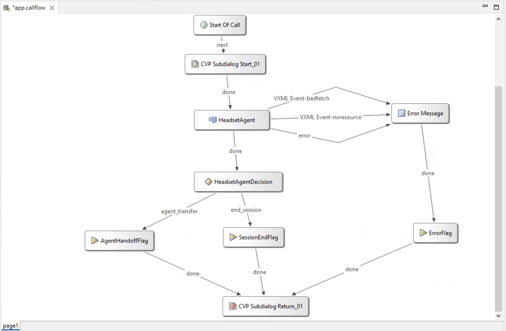

# Lab 3 - Import and Customize an AI Agent

## **Objectives**

In this lab you will build a scripted AI agent that can respond to both chat and voice channels:

- Know how to import an exported agent
- Know how to create Intents, Entities, and Responses
- Know how to return data back to the calling application
- Know how to use previous interactions to troubleshoot intent and response mapping

This agent will collect the order number and a user PIN from the user, then pass that information back to the Call Studio application. The studio application will then call a RESTful API to get order status and return this status back to the AI Agent. The AI Agent will play the order status back to the customer.

Explanation of formatting:

- *Italics* – This indicates a button, menu option, or object that should be selected.
- "Quoted Text" – This indicates that the text should be typed exactly as indicated.

## **Task 1. Import and Customize an Agent**

In this task, we will import an agent that we have configured for you ahead of time.

**Step 1.** Download the example agent and import into AI Agent Studio

a. Select the [Scripted AI Agent](./downloads/OrderingAIAgent.zip) to download the AI Agent to your desktop. Once you have done this, extract the zip file so that you have the JSON file ready.

b. In AI Agent Studio, select the *Import agent* button at the top, right side of the studio.


c. Select the *Upload* button, then navigate to where you extracted the Agent and select it to import. Provide an agent name that in unique. To do this, include your seat number in the format of, "S01 - My Order Fulfillment Agent". Note that the System ID will be automatically generated, accept the default. After validating that everything is correct, select the *Import* button at the bottom, right of the page.


**Step 2.** Add Intent and Response to collect required information

a. In the AI Agent configuration, navigate to ***Script*** -> ***Intents*** -> click on the ***Create intent*** button.


b. Enter the Intent name as "Start Order Tracking" and enable the toggle button to ***Reset slots after completion***.

c. Under the ***Intent and Utterances*** section, type the phrase "Track my order" and click the ***Add** button.


d. Next, add a 2nd utterance by typing "track order number 123456 with pin 1234" and clicking the ***Add*** button.

- As soon as the 2nd utterance is added, the 6 digit number and the 4 digit pin will be highlighted and previously created entities of 'order_number' and 'user_pin' are added under the ***Slot filling*** section.
- In the Slot filling section, check the ***Required*** box for each of these slots.

 

> What is an entity?
>> Entities are the building blocks of conversations. They are essential elements that the AI agent extracts from user utterances. Entities represent specific pieces of information, such as product names, dates, quantities, or any other significant group of words. By effectively identifying and extracting entities, the AI agent can better understand user intent and provide more accurate and relevant responses.

> What is a slot?
>> The value collected for an entity is called a slot. Consider the following analogy, entity is a variable name and slot is the value of that variable.

> Why do I need to create a slot here? 
>> As part of the Intent, the bot needs to collect the basic info like order number and the user pin so that these 2 values can be passed to go look for the status of an order in the database.

e. Add the Response for missing order number by selecting the drop-down next to the order_number entity in the *Slot filling* section. In the search box, begin typing the phrase "order_number" and select the Custom response named, "order_number".


Repeat this for the user_pin entity. The response name you need to find is "pin_missing". Reference the image below for the completed Slot filling section.


f. On the "Start Order Tracking" Intent configuration page and under the ***Intent and utterances*** section, click on the ***Generate*** button.
 

g. In the ***Generate variants*** dialog box, provide a description as described below to generate relevant training data and utterances.
```
Generate prompts to track an order. Five of those prompts include a 6-digit order number. Another five of the prompts include a 6-digit order number and a 4-digit pin.

```

h. In the ***Number of variants*** enter 20 and set ***Creativity*** to High. Lastly, click the ***Generate*** button.


i. This is what your ***Intent and utterances*** configuration section should now look like. The ***order_number*** and ***user_pin*** slots should now be highlighted automatically. You can add more utterances if you like.

*Note: Hallucinations should be rare, but review the generated utterances to enure there are no hallucinations.*


You can also add an utterance as a Regular Expression (RegEx)

- track\*.\*order
- order\*.\*track


**Step 3.** Create Response to return data to Call Studio

a. In the ***Response*** section, select the drop down and click on ***Create new***.


b. In the ***Create a response*** pop up windows, enter the response name as ***track_order_wait*** and then select the + symbol and click on ***Voice*** to add Voice channel.

c. In the Text section, add the text below as ***Variant 1***. Feel free to add more of these variants if you like.

```
Please wait while I track your order.

```

d. Now, click on the ***Custom Event*** button to the right to create a custom event and enter as shown below:

- **Event name:** 
```
custom_event
```
- **Event payload:** 
```
{
  "Execute_Request": {
    "Data": {
      "Params": {
        "order_number": "${entity.order_number}",
        "user_pin": "${entity.user_pin}"
      }
    },
    "Event_Name": "custom_event"
  }
}
```

e. Lastly, click ***Create*** and this will take you back to the "Start Order Tracking" Intent configuration page.


> Why do we need to add Custom Event here?
>> Custom Event is being added here to pass the order_number and user_pin entity data collected by the AI Agent, back to the Call Studio app. This is coming up in the next lab guide.

**Step 6.**
Verify that you've completed all of the required configurations as seen in the screenshot below and click ***Create***.


## **Task 2. Test AI Agent and Review Session History**

In this task, you will test the AI Agent that you created above. This will let you validate that everything is working correctly. Cisco supports testing with both text and voice.

**Step 1. Text Preview**

Select the *Preview* button at the top of the screen. Note that you do not need to publish the agent to preview.


The preview interface pops up at the bottom. Select, *Start a chat* to begin testing.


**Step 2. Chat with Agent**

You will see your Welcome message come up on the screen. To begin testing, type the question, "What type of headsets does Cisco sell?". You can see the example response that was generated when the lab guide was built. Because this is an LLM generated AI Agent, the result that you receive, may be different. Select the *Read More* link in the response to read the entire response. This will let you read the full response that was generated.


Continue to interact with the agent and ask questions. You may want to ask which headsets are bluetooth enabled or which ones have boom mics. To test the guardrails, ask it a non-related question such as, "What is the weather in San Diego today?"

**Step 3. Review Session History**

After you have done testing the Agent are are satisfied with the results, select the *Sessions* menu at the left. This opens the sessions list and allows you to see the messages sent and responses that were generated.


Locate the session record for the test session and click on it. 


You will see the agents message, the customer's response to the message, then the agents reply to that message. Select the first response to the "What type of headsets does Cisco sell?". Note that you may select either the agent's message or the customer's message. In the right side, notice that you can see the specific knowledge base used as well as the detected language and the AI Engine. 


Click the down arrow next to the Knowledge Base to review the documents and pages where the agent generated the information. Notice as you scroll down, you can see each document which information was pulled from and the specific page and content. 


**Step 4. Publish the AI Agent**

If you are not already on the Configuration page, select the *Configuration* menu at the left. Select *Publish* at the top of the page. In the *Publish and track changes* box, enter a comment about this publication. In the example, we have entered "Initial publication". These comments will help you identify what has changed later so ensure that these are meaningful to you.


Before we go any further, Select the *History* menu. Here, you can see the history of the publications and once there are more than one version, you can select the drop-down in the controls column to revert to a previous release. You will also see that you can export a specific version of the agent if you need to fork the development for some reason.


## **Task 3. Integrate to Call Flow**

We have now created an AI Agent and have tested it to ensure it's working. We are now ready to integrate into a call flow.  You will download a shell application that we have created for you. You will import this, then modify it to call the Agent that you created above.

**Step 1.** Download the application by clicking on, [NativeAI_Scripted](./downloads/NativeAI_Scripted.zip)). Remember where you download this to as you will need it in step 3. You do not need to extract the zip.

**Step 2.** Open mRemoteNG on WKST1 if you do not already have mRemote open, then login to CVP. Once you have logged in to CVP, locate the Call Studio icon on the desktop and double-click it to open Call Studio.


**Step 3.** Import the application you have downloaded.

- Select the *File* menu, then select *Import*.

    

- In the box that pops up, select *Projects from Folder or Archive*, then select *Next*.

    

- In the *Import Projects from Folder or Archive* dialog box, select the *Archive* button at the top of the box, then navigate to where you downloaded the example application and select it. You should **not** import the *CLUS_NativeAI.zip* file in the downloads directory. Once you are back at the import dialog, ensure that you uncheck the folder "NativeAI_Autonomous.zip_expanded" and leave the "NativeAI_Autonomous.zip_expanded\NativeAI_Auto" selected. Refer to the image and once all options are set, select *Finish*.

    

**Step 4.** In the *Project Explorer*, locate the *NativeAI_Auto* project. Expand this and double-click on the *app.callflow* to open the example application.

 

**Step 5.** Review the application that you have imported. You will see that we have already added the required elements to the canvas.



Refer to the table for what each element is used for.

| **Element Name** | **Element Type** | **Element Function**|
| --- | ---| --- |
| CVP Subdialog Start_01 | CVP Subdialog Start | Mandatory element for all Comprehensive Call Flows to receive data from CCE. |
| CVP Subdialog End_01 | CVP Subdialog End | Mandatory element for all Comprehensive Call Flows to return data to CCE. |
| HeadsetAgent | VirtualAgentVoice | VAV element which allows CCE to interact with the Native AI agent. |
| HeadsetAgentDecision | Decision | Decision elements allow the user to take different outcomes based on the output of a previous element. This decision element handles the output from the TrackerBotStart VAV element. |
| ErrorMessage | Audio | Audio elements allow script to play either static audio files or play text to speech files through an ASR/TTS server. |
| AgentFlag | Flag | Flag elements can be added to scripts to help with tracking calls through the logs and indicating what path a script has taken |
| ErrorFlag | Flag | Flag elements can be added to scripts to help with tracking calls through the logs and indicating what path a script has taken |
| SessionEndFlag |  Flag | Flag elements can be added to scripts to help with tracking calls through the logs and indicating what path a script has taken |

Once you have imported the app, you are ready to start configuring the elements required to interact with the agent.

**Step 6.**  Update the VAV Element with the Agent ID from AI Agent Studio.

a. Select the HeadsetAgent VAV element, then select the *Settings* tab. The *Webex AI Agent* setting allows you to select which type of VAV bot you will be working with. Notice that we have selects the value, *Autonomous* in the dropdown.


b. Immediately under the *Webex AI Agent* setting, you will see the *Bot ID* setting. The value you see is the ID of the agent that was used to create this lab and may not be in the tenant you are using.


To find the value you need to use, open your Webex AI Studio, select the bot you created above. Select the 3 dots at the top, right-hand side of the screen, and in the drop-down, select *Copy agent ID*.


Paste the agent ID you copied into the value for *Bot ID.* While you have this in your clipboard, locate the TrackerBotOrderStatus element and make the same two updates.  

**Step 7.** Deploy the Application

a. If you have not saved your application, do so now by selecting the save icon in the toolbar.

b. Validate the application. Right-click the *NativeAI_Auto* application and select *Validate*.


Check the errors grid at the bottom of the screen to ensure nothing is shown. If you do see any errors, review the error and resolve the issue by referring back to the portion of the lab where that item was configured.

c. Deploy the application to the VXML Server. Right-click on the *NativeAI_Auto* application and select *Deploy*.


d In the window that pops-up, leave the values at their defaults. The *NativeAI_Auto* application checked and the folder left as "C:\Cisco\CVP\VXMLServer" and click *Finish*.

e. On the CVP VXML server, deploy the application. Navigate to "C:\Cisco\CVP\VXMLServer\applications\NativeAI_Auto\admin". Double-click *deployApp.bat*.

f. In the command window that pops up, type "yes" to confirm that you want to deploy the application. Hit enter one more time after the application has been deployed to close the command prompt window.

**Step 8.** Update CCE Script to use the new application

a. In your mRemote window, locate the AW-HDS-DDS server and login.


b. Open the Script Editor by opening the Unified CCE Administration Tools folder on the desktop, then opening the *Script Editor* link.


c. Open the script named, CumulusInbound.


Select the Edit button in the toolbar.


d. Locate the *Set Variable* node which sets the VXML Application name (the fourth node from the top left).


Open it and update the name of the script (currently HelloWorld) to "NativeAI_Auto".


e. Select the *Save* button in the toolbar to make this change live, then select the *Monitor Script* button.


After a moment, you will see green boxes between each of the nodes. This will let you see the call's progress through the script visually. It is expected that all the green boxes show 0 as we have not placed any calls to this script yet.


## **Task 4. Test Call Flow**

**Step 1.**
Use your mobile phone to call into the number. 

a. Locate the Main phone number for your session. On WKST1 open a browser and open a new tab, then in the default page that appears, select ***Demo Links*** -> ***Demo Website***.

  

b. In the Cumulus Finance website that is shown, select the blue box on the right-hand side that reads ***Talk to an Expert***.

 

c. In the box that pops out, select the Call Us link. In the box that pops up, note the Main number, this is what you will use to test your lab.

**IMPORTANT: THE NUMBER SHOWN IN THE IMAGE IS NOT THE NUMBER YOU WILL USE FOR YOUR LAB. ENSURE THAT YOU FIND THE NUMBER FOR YOUR SESSION!**

 

**Step 2.**
Use your mobile phone to call into the number. You should hear the bot greet you by name and your town, then ask how to help.

**Step 3.**
Recommended ways to test the agent.

1. After the agent answers and greets you, ask which headsets support bluetooth.
2. Ask which headsets have boom mics.


**Step 4.**
Feel free to test out a few different ways of asking for the information.
