# Lab 4 - Digital Deflection

## **Objectives**

In this lab, you will learn how to integrate an Autonomous AI agent into a chat flow.

- Know how to create an Autonomous AI Agent from scratch and map it to a knowledge base.
- Create an agent goal, instructions, and welcome message.
- Understand how to configure and use fulfillment.
- See how to integrate the AI Agent into a call studio script.

Explanation of formatting:

- *Italics* - This indicates a button, menu option, or object that should be selected.
- "Quoted Text" - This indicates that the text should be typed exactly as indicated.

## **Instructor Demonstrated**

Note, this lab is going to be instructor demonstrated. 

## **Task 1.**

In this task, we will create the AI Agent and define define the agent's goal, instructions, and welcome message.

- Goal: What is the primary objective of the AI agent?
- Instructions: How should your agent interact with customers to perform its task?
- Welcome Message: How should your agent greet your customer initially?


# Lab 5 - Integrate an Inbound Chat Flow with your AI Agent (BONUS Lab)


## **Task 1. Create Intents**

In this task, we will create the following 2 Intents

 - Chat Start Order Tracking
 - Chat Order Results


**Step 1.**
Create Intent - "Chat Start Order Tracking" 

a. In the AI Agent configuration, navigate to ***Script*** -> ***Intents*** -> click on the ***Create intent*** button.

   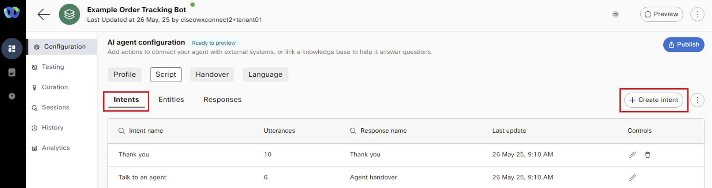


b. Enter the Intent name as "Chat Start Order Tracking".


c. Under Intent and Utterances section, type the phrase "Start_Chat" and click the ***Add*** button.


Note:

 - For the Voice channel, the welcome_event was sent from the Call Studio script as the trigger for the AI Agents' welcome message.
 - Similarly, for the Web (Chat) channel, the phrase "Start_Chat" will be used as the trigger for the AI Agents' welcome message. This will be configured in the Inbound Flow in a later step.


d. In the ***Response*** section, from the drop down, select ***Welcome message***.


e. Lastly, click ***Create*** to complete the "Chat Start Order Tracking" intent configuration.

   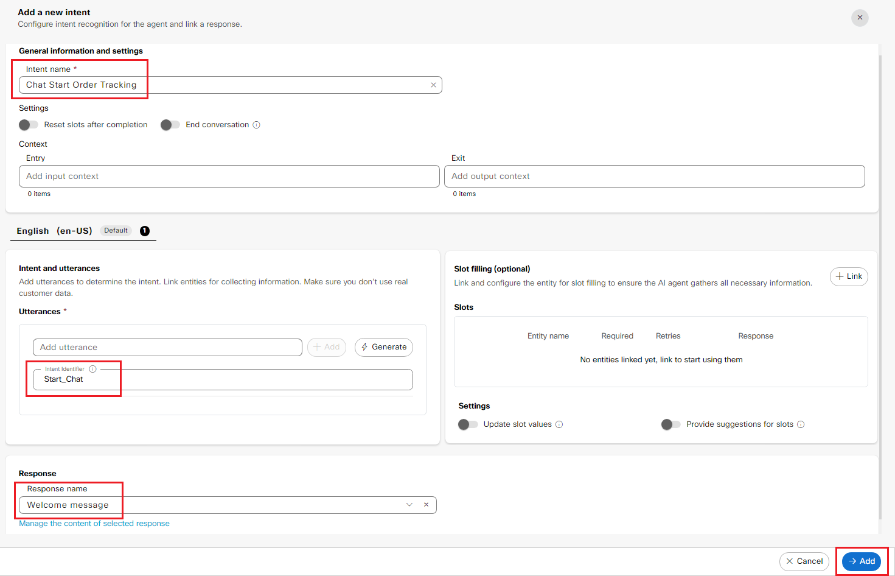


**Step 2.**
Create Intent - "Chat Order Results"

a. In the AI Agent configuration, navigate to ***Script*** -> ***Intents*** -> click on the ***Create intent*** button.

   


b. Enter the Intent name as "Chat Order Results".


c. Under Intent and Utterances section, type the phrase "order_results" and click the ***Add*** button.


Note:

 - In the Inbound Flow, once the order_number and user_pin slots are collected as part of the "Start Order Tracking" Intent, the Inbound Flow sends the order_results message to trigger the track_order_results response.


d. In the ***Response*** section, from the drop down, select ***track_order_results***.


e. Lastly, click ***Create*** to complete the "Chat Order Results" intent configuration.

   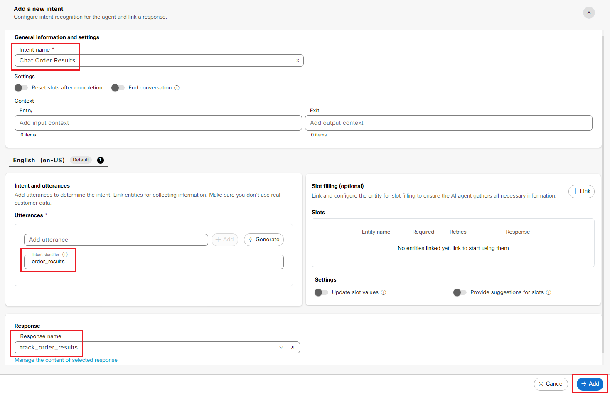


## **Task 2. Update Responses for the Default channel (web)**

In this task, we will be updating the following responses - Default channel (web) - Chat

 - Welcome message
 - order_number
 - pin_missing
 - track_order_wait
 - track_order_results
 - track_another_order
 - Goodbye


**Step 1.**
Update the ***Welcome message*** response

a. In the AI Agent configuration, navigate to ***Script*** -> ***Responses*** -> click on the ***Welcome message*** response.
   


b. On the left side of the response window, click on the previously created conditional response "check_if_name_is_passed" -> Select the ***Rules*** tab. 


c. Click the ***+OR Condition*** button and enter as below:

 - ***Left variable:*** consumerData.extra_params.name
 - ***Operator:*** Exists

 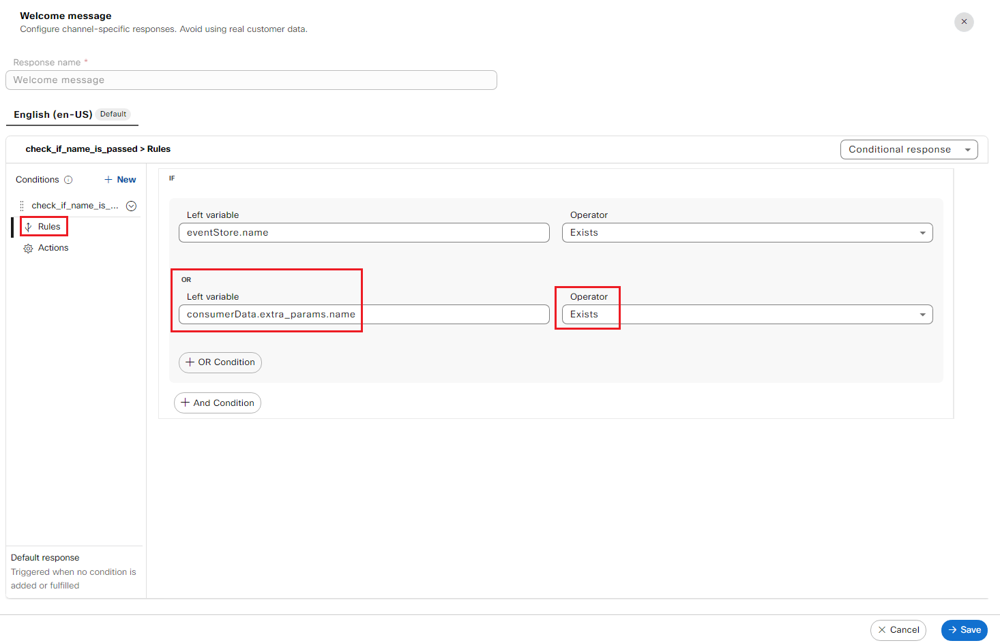


c. Next, select the ***Actions*** tab on the left and click the Default (web) tab (Note: since this is for the chat channel, ensure you are NOT selecting Voice option)

 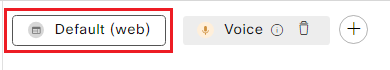


d. Add the text below as ***Variant 1*** in the Text section. Feel free to add more of these variants if you like.
Note: consumerData.<param> is how we can reference data that is passed from Chat Flow to the bot.

```
Hello  ${consumerData.extra_params.name} , I am a Tracker bot. I can help you track your packages. How can I help you today? To get started, please ask me to track an order number.

```

 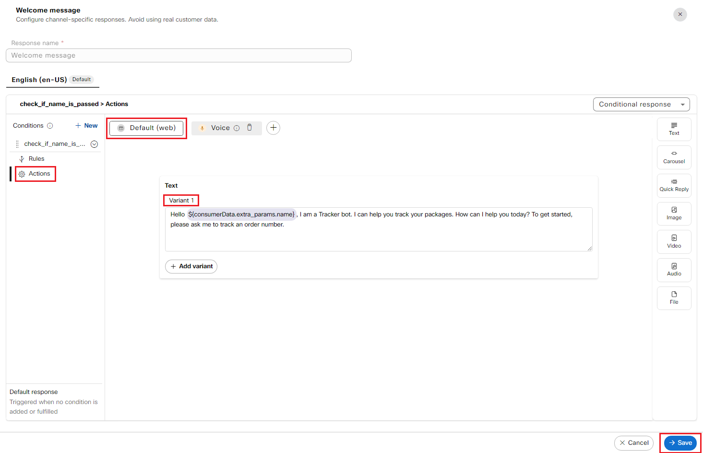


**Step 2.**
Update the ***order_number*** response


a. In the AI Agent configuration, navigate to ***Script*** -> ***Responses*** -> click on the ***order_number*** response.


b. Next, click on the ***Default (web)*** button and enter the below text as Variant 1.

```
Please provide your six digit order number.
```

 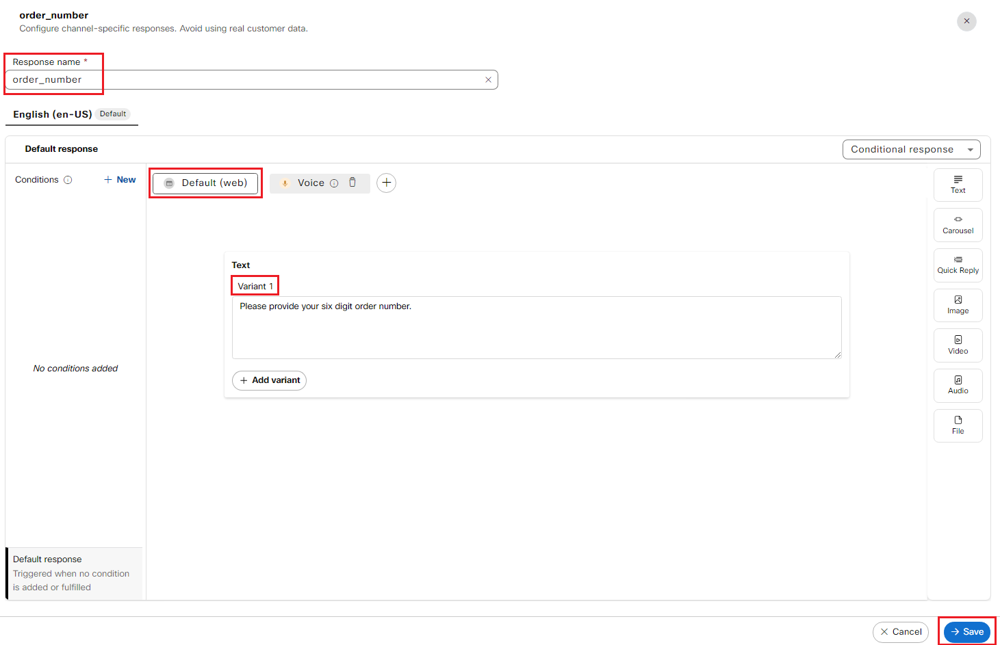
 
 
 

**Step 3.**
Update the ***pin_missing*** response

a. In the AI Agent configuration, navigate to ***Script*** -> ***Responses*** -> click on the ***pin_missing*** response.


b. Next, click on the ***Default (web)*** button and enter the below text as Variant 1.

```
Please provide your four digit PIN.
```

 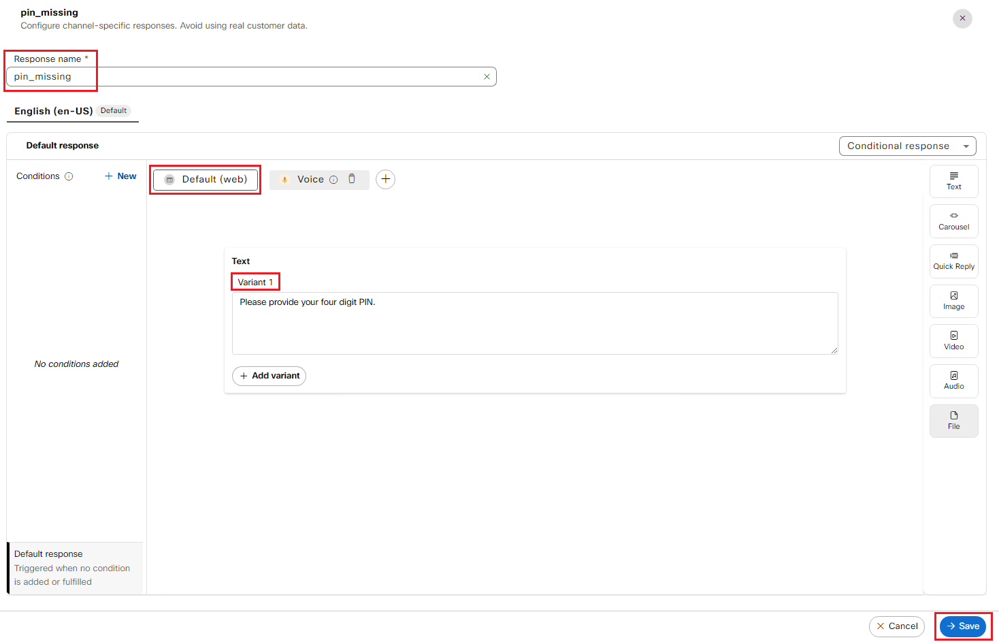


**Step 4.**
Update the ***track_order_wait*** response

a. In the AI Agent configuration, navigate to ***Script*** -> ***Responses*** -> click on the ***track_order_wait*** response.


b. Next, click on the ***Default (web)*** button and enter the below text as Variant 1.

```
Getting your package details now...
```

 
 


 
**Step 5.**
Update the ***track_order_results*** response

a. In the AI Agent configuration, navigate to ***Script*** -> ***Responses*** -> click on the ***track_order_results*** response.


b. On the left side of the response window, click on the previously created conditional response "order_status_check" -> Select the *Rules* tab 


c. Click the ***+OR Condition*** button and enter as below:

 - ***Left variable:*** consumerData.extra_params.order_status
 - ***Operator:*** Exists

 


c. Next, select the ***Actions*** tab on the left and click the Default (web) tab (Note: since this is for the chat channel, ensure you are NOT selecting Voice option)

 


d. Add the text below as ***Variant 1*** in the Text section. Feel free to add more of these variants if you like.
Note: consumerData.<param> is how we can reference data that is passed from Chat Flow to the bot.

```
We have found your order. ${consumerData.extra_params.order_status}  Do you need anything else?

```

 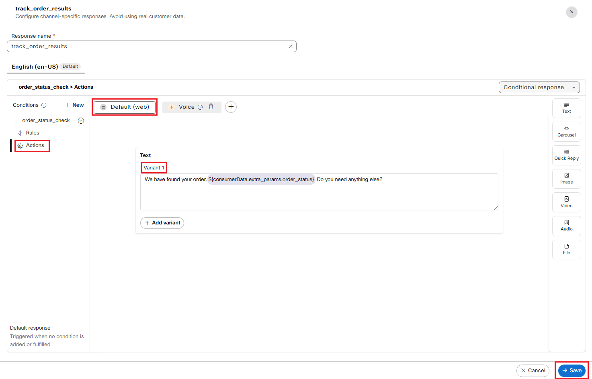


**Step 6.**
Update the ***track_another_order*** response
 

a. In the AI Agent configuration, navigate to ***Script*** -> ***Responses*** -> click on the ***track_another_order*** response.


b. Next, click on the ***Default (web)*** button and enter the below text as Variant 1.

```
Great! To get started, please ask me to track an order number.
```

 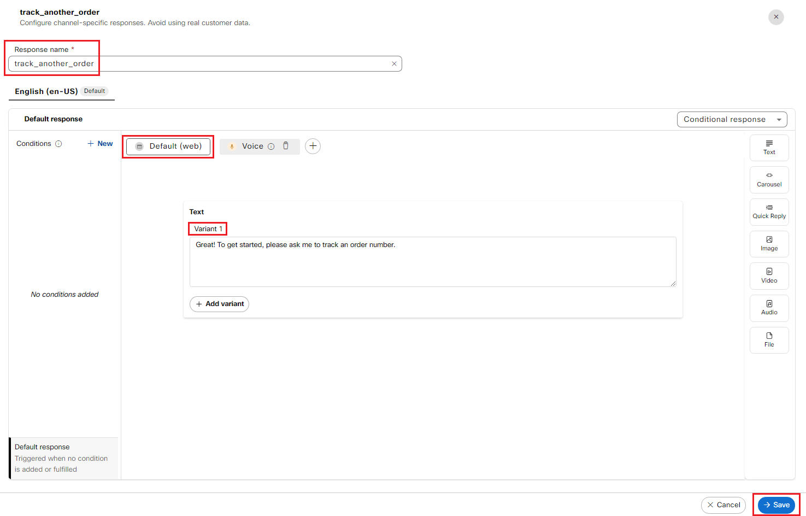


**Step 7.**
Update the ***Goodbye*** response

a. In the AI Agent configuration, navigate to ***Script*** -> ***Responses*** -> click on the ***Goodbye*** response.


b. Next, click on the ***Default (web)*** button and enter the below text as Variant 1.

```
Thank you for your response! I will now connect you to a live agent for further assistance! Have a wonderful day!
```

 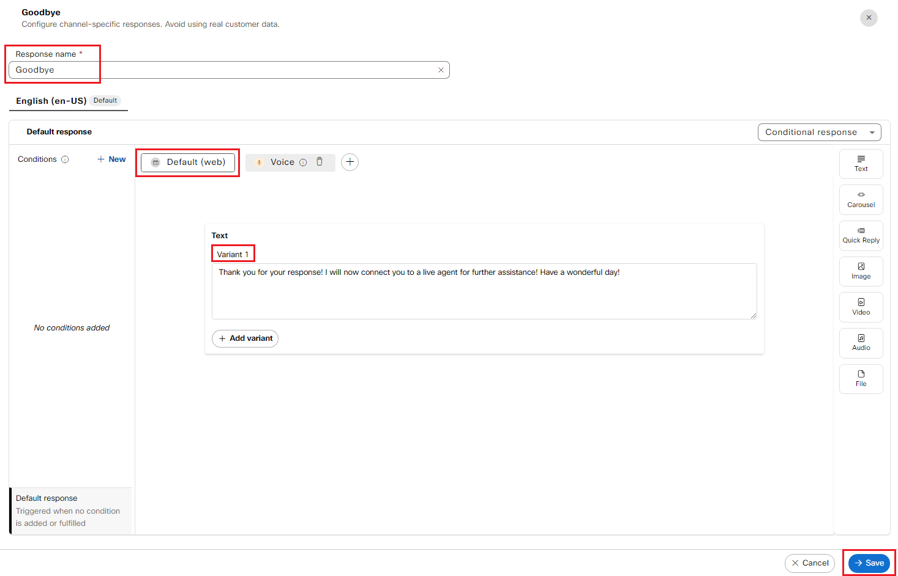


## **Task 3. Import and Configure the Native AI Inbound Chat Flow**

**Step 1.**
Navigate to this link to download the "AI Agent Chat Inbound Flow" on to the Downloads folder

*Link*


**Step 2.**
Log into Webex Control Hub ***admin.webex.com*** and navigate to ***Contact Center*** -> ***Digital*** -> ***Webex Connect***.
This opens up the Webex Connect portal.

 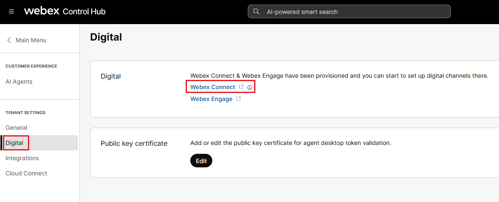


**Step 3.**
Navigate to Services tab and select the Service created for you seat number.


**Step 4.**
Click the ***Create Flow*** button -> enter a Flow Name -> select ***Upload a Flow*** -> Choose the downloaded file -> Click ***Create***


**Step 5.**
Update the ***Bot Start*** and the ***Bot OrderResults*** nodes

- Under the ***Agent*** field, select the AI Agent Bot you created

 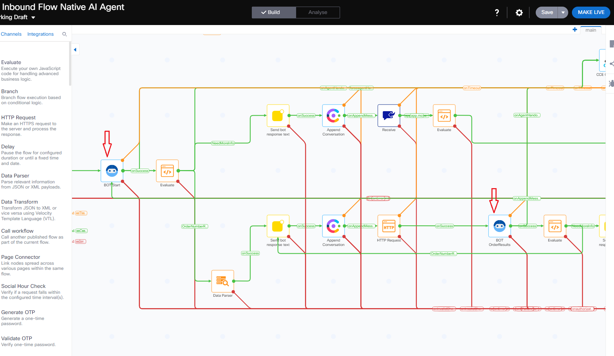

 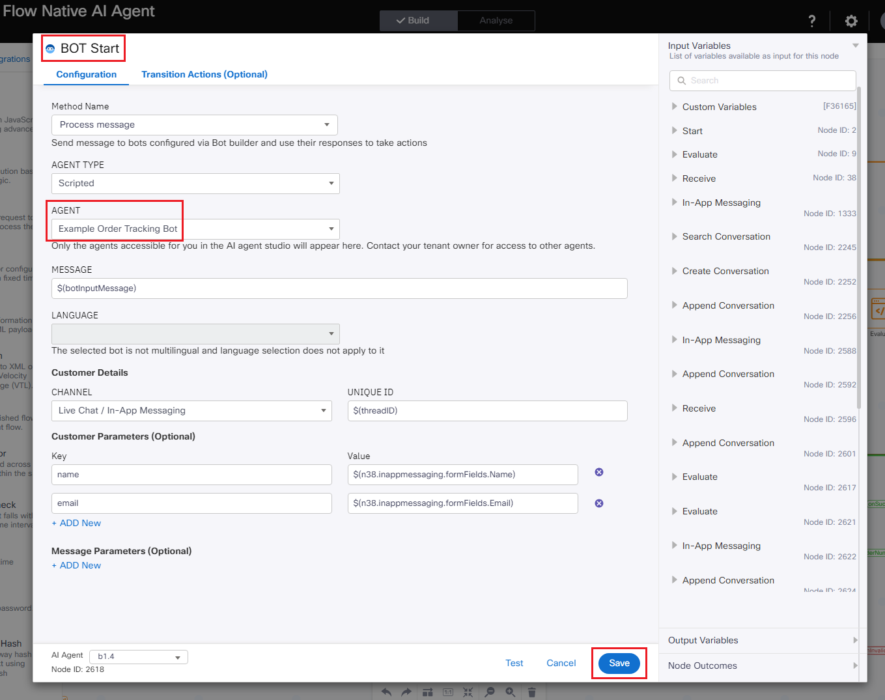

 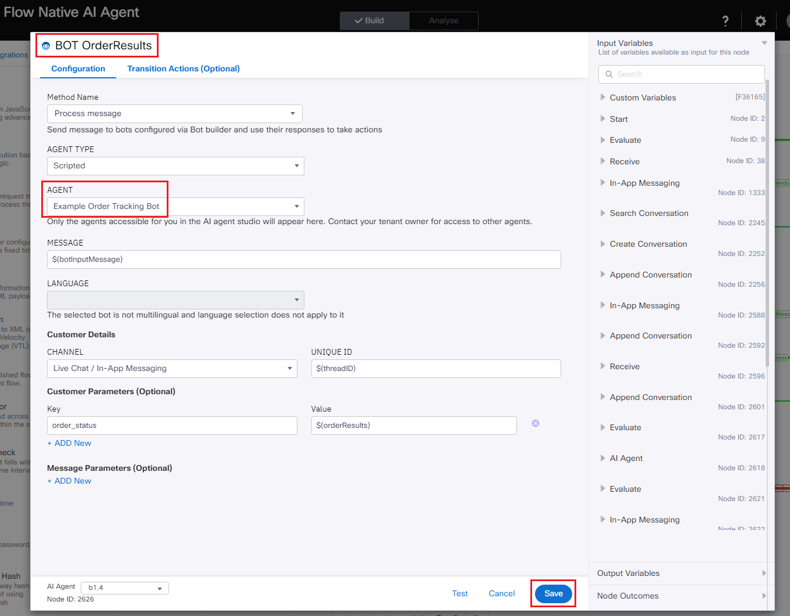


**Step 6.**
Review the nodes to see where the messages are sent to the AI Agent.


**Step 7.**
Click on the Settings tab and update the following variables:

 - CloudConnectFQDN
 - botInputMessage

 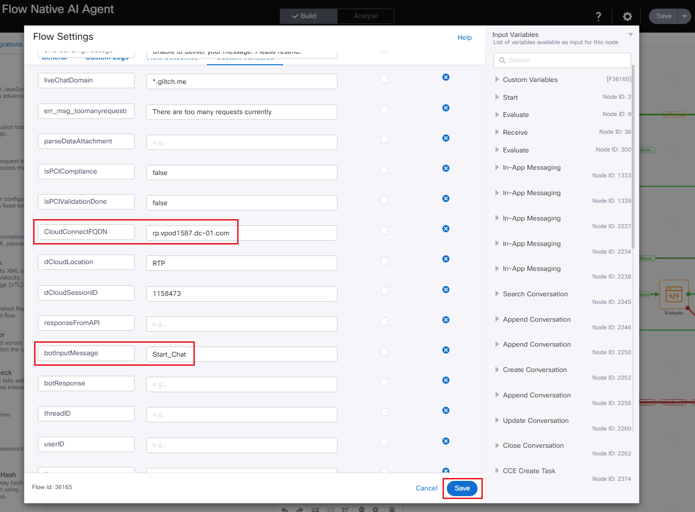


**Step 8.**
Save and Make Live

 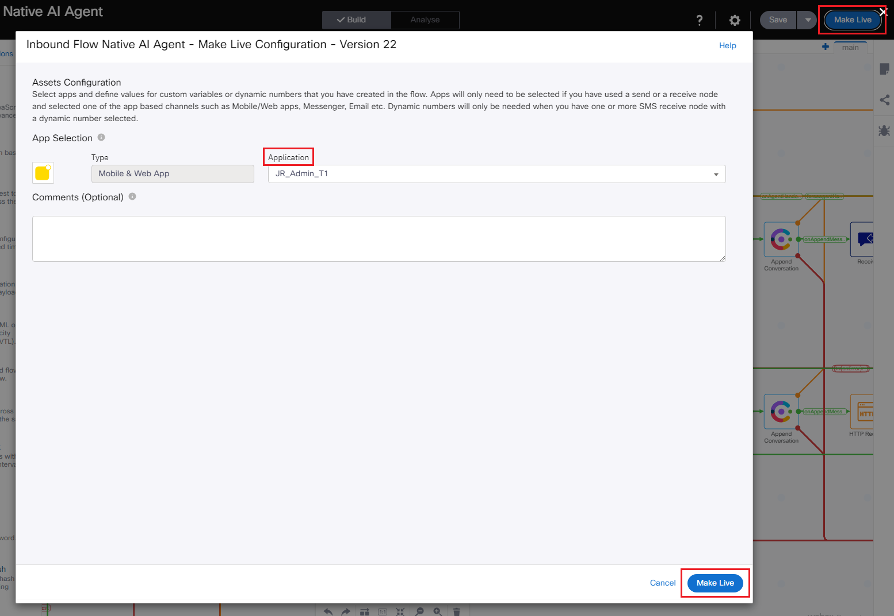


## **Task 4. Test and Troubleshoot**

**Step 1.**
Note down the Reverse Proxy FQDN for your session.

From the eXpo home page, click on the ***Details*** tab -> ***DNS Address*** -> copy the DNS name that start with ***rp.vpod***

 


**Step 2.**
On a browser, navigate to the following URL - glitch
Note: Update the URL per your seat number, before pasting it on the browser.


**Step 3.**
To start a Chat, click on the ***Chat icon*** to the bottom-right corner of the screen.


