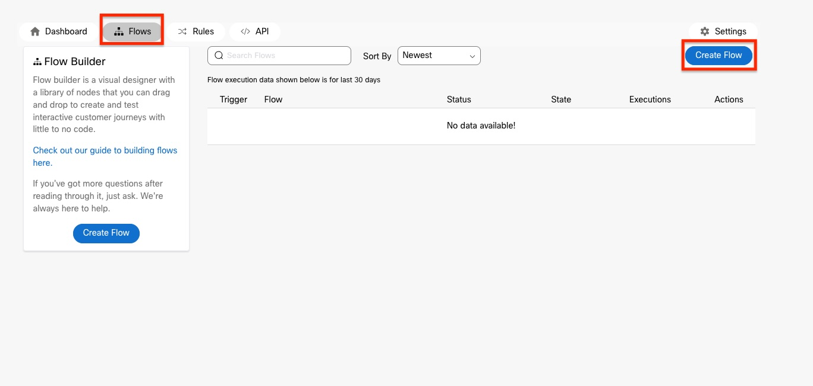
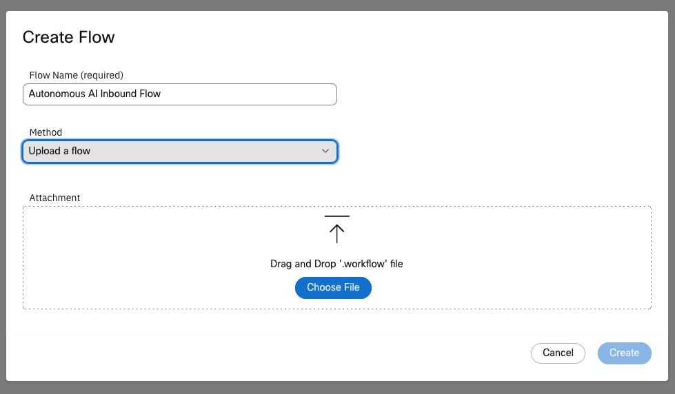
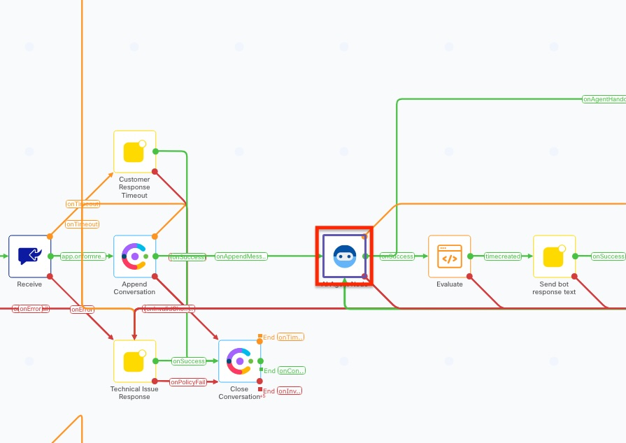
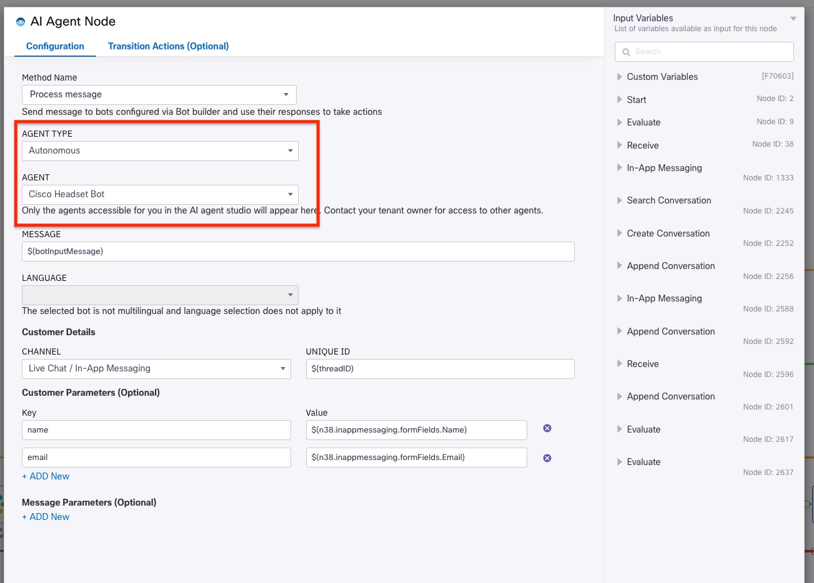
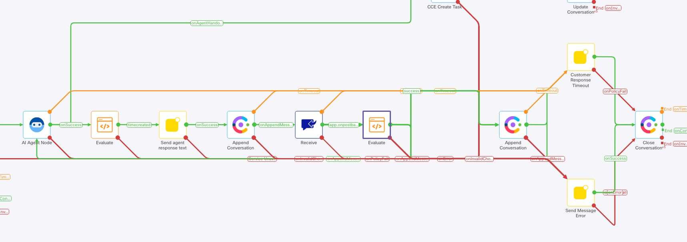

# Lab 4 - Digital Deflection

## **Objectives**

In this lab, you will learn how to integrate an Autonomous AI agent into a chat flow.

- Know how to create an Autonomous AI Agent from scratch and map it to a knowledge base.
- Create an agent goal, instructions, and welcome message.
- Understand how to configure and use fulfillment.
- See how to integrate the AI Agent into a call studio script.

Explanation of formatting:

- *Italics* - This indicates a button, menu option, or object that should be selected.
- "Quoted Text" - This indicates that the text should be typed exactly as indicated.

**Instructor Demonstrated**

Note, this lab is going to be instructor demonstrated. There are no tasks that you will do in this lab. The lab guide is provided for you 

## Section 1 - Add Autonomous AI Agent to Inbound chat flow

In this section we will integrate the Autonomous AI agent to a inbound chat flow. You will not perform any of the steps in this section, they are simply for your reference.

# **Task 1. Import Inbound Flow**

**Step 1.** Download a customized Inbound flow by selecting the [link](./downloads/AutonomousAI_Inbound.zip). Unzip this to a location on your computer.

**Step 2.** Login to Webex Connect by navigating to the *Contact Center* -> *Digital* menu options in Webex Control Hub.

**Step 3.** Ensure that you have created a Live Chat Asset and Service to use. You can find instructions [here](https://help.webexconnect.io/docs/live-chat-cce){:target="_blank"}.

**Step 4.** In the service you created, select *Flows*, then select the *Create Flow* button. 





- Provide a descriptive name for the Flow Name.
- From the *Method* drop-down, select "Upload a flow"
- Either drag and drop the extracted flow into the *Attachment* box or, select *Choose File* and navigate to where you extracted the zip file and choose the .workflow file.
- Select *Create* to upload this flow and open it.

**Step 5.** Modify the flow.

a. Accept the defaults in the initial Configure APP Event.

b. Locate the *AI Agent Node* and open it.



c. In the AI Agent Node, select *Autonomous* from the *Agent Type* drop-down box. Next, select the AI Agent you created in the *Agent* drop-down.



Note the Message is a variable. Each time that the loop occurs, this message will be updated with the customer's response back to the agent. This variable should be set to a message which will start the agent such as "Hello".

d. Review the remaining nodes in the workflow. These are as follows:



- Evaluate - This simply sets the timestamp to the current time.
- Sent agent response text - This will display the response from the agent to the customer.
- Append Conversation - This will write the agent response to history.
- Receive - This receives the response from the customer back to the agent.
- Evaluate - This normalizes the response from the customer and ensures there are no content issues. This will then set the input message variable to the sanitized response.
- Append Conversation - This writes the customer's response to history.

e. At any point if the customer asks to speak to an agent, the AI Agent Node will take the onAgentHandover exit path and will be sent to CCE for agent handling.

## Section 2 - Scripted AI Agent Steps

Note: This is not going to be shown in the class but is here so you can see what changes need to be made to the AI agent to add in chat support.

# **Task 1. Create Intents**

In this task, we will create the following 2 Intents

- Chat Start Order Tracking
- Chat Order Results

**Step 1.** Create Intent - "Chat Start Order Tracking"

a. In the AI Agent configuration, navigate to ***Script*** -> ***Intents*** -> click on the ***Create intent*** button.

   

b. Enter the Intent name as "Chat Start Order Tracking".

c. Under Intent and Utterances section, type the phrase "Start_Chat" and click the ***Add*** button.

Note:

- For the Voice channel, the welcome_event was sent from the Call Studio script as the trigger for the AI Agents' welcome message.
- Similarly, for the Web (Chat) channel, the phrase "Start_Chat" will be used as the trigger for the AI Agents' welcome message. This will be configured in the Inbound Flow in a later step.

d. In the ***Response*** section, from the drop down, select ***Welcome message***.

e. Lastly, click ***Create*** to complete the "Chat Start Order Tracking" intent configuration.


**Step 2.** Create Intent - "Chat Order Results"

a. In the AI Agent configuration, navigate to ***Script*** -> ***Intents*** -> click on the ***Create intent*** button.


b. Enter the Intent name as "Chat Order Results".

c. Under Intent and Utterances section, type the phrase "order_results" and click the ***Add*** button.

Note:

- In the Inbound Flow, once the order_number and user_pin slots are collected as part of the "Start Order Tracking" Intent, the Inbound Flow sends the order_results message to trigger the track_order_results response.

d. In the ***Response*** section, from the drop down, select ***track_order_results***.

e. Lastly, click ***Create*** to complete the "Chat Order Results" intent configuration.


# **Task 2. Update Responses for the Default channel (web)**

In this task, we will be updating the following responses - Default channel (web) - Chat

- Welcome message
- order_number
- pin_missing
- track_order_wait
- track_order_results
- track_another_order
- Goodbye

**Step 1.** Update the ***Welcome message*** response

a. In the AI Agent configuration, navigate to ***Script*** -> ***Responses*** -> click on the ***Welcome message*** response.


b. On the left side of the response window, click on the previously created conditional response "check_if_name_is_passed" -> Select the ***Rules*** tab. 

c. Click the ***+OR Condition*** button and enter as below:

- ***Left variable:*** consumerData.extra_params.name
- ***Operator:*** Exists


c. Next, select the ***Actions*** tab on the left and click the Default (web) tab (Note: since this is for the chat channel, ensure you are NOT selecting Voice option)


d. Add the text below as ***Variant 1*** in the Text section. Feel free to add more of these variants if you like.

Note: consumerData.<param> is how we can reference data that is passed from Chat Flow to the bot.

```
Hello  ${consumerData.extra_params.name} , I am a Tracker bot. I can help you track your packages. How can I help you today? To get started, please ask me to track an order number.

```

 

**Step 2.** Update the ***order_number*** response

a. In the AI Agent configuration, navigate to ***Script*** -> ***Responses*** -> click on the ***order_number*** response.

b. Next, click on the ***Default (web)*** button and enter the below text as Variant 1.

```
Please provide your six digit order number.
```

 

**Step 3.** Update the ***pin_missing*** response

a. In the AI Agent configuration, navigate to ***Script*** -> ***Responses*** -> click on the ***pin_missing*** response.

b. Next, click on the ***Default (web)*** button and enter the below text as Variant 1.

```
Please provide your four digit PIN.
```


**Step 4.** Update the ***track_order_wait*** response

a. In the AI Agent configuration, navigate to ***Script*** -> ***Responses*** -> click on the ***track_order_wait*** response.

b. Next, click on the ***Default (web)*** button and enter the below text as Variant 1.

```
Getting your package details now...
```

 

**Step 5.** Update the ***track_order_results*** response

a. In the AI Agent configuration, navigate to ***Script*** -> ***Responses*** -> click on the ***track_order_results*** response.

b. On the left side of the response window, click on the previously created conditional response "order_status_check" -> Select the *Rules* tab 

c. Click the ***+OR Condition*** button and enter as below:

- ***Left variable:*** consumerData.extra_params.order_status
- ***Operator:*** Exists

 

c. Next, select the ***Actions*** tab on the left and click the Default (web) tab (Note: since this is for the chat channel, ensure you are NOT selecting Voice option)


d. Add the text below as ***Variant 1*** in the Text section. Feel free to add more of these variants if you like.

Note: consumerData.<param> is how we can reference data that is passed from Chat Flow to the bot.

```
We have found your order. ${consumerData.extra_params.order_status}  Do you need anything else?

```

 

**Step 6.** Update the ***track_another_order*** response

a. In the AI Agent configuration, navigate to ***Script*** -> ***Responses*** -> click on the ***track_another_order*** response.

b. Next, click on the ***Default (web)*** button and enter the below text as Variant 1.

```
Great! To get started, please ask me to track an order number.
```

 

**Step 7.** Update the ***Goodbye*** response

a. In the AI Agent configuration, navigate to ***Script*** -> ***Responses*** -> click on the ***Goodbye*** response.

b. Next, click on the ***Default (web)*** button and enter the below text as Variant 1.

```
Thank you for your response! I will now connect you to a live agent for further assistance! Have a wonderful day!
```

 

# **Task 3. Import and Configure the Native AI Inbound Chat Flow**

**Step 1.** Navigate to this link to download the "AI Agent Chat Inbound Flow" on to the Downloads folder

*Link*

**Step 2.** Log into Webex Control Hub ***admin.webex.com*** and navigate to ***Contact Center*** -> ***Digital*** -> ***Webex Connect***. This opens up the Webex Connect portal.

 


**Step 3.** Navigate to Services tab and select the Service created for you seat number.

**Step 4.** Click the ***Create Flow*** button -> enter a Flow Name -> select ***Upload a Flow*** -> Choose the downloaded file -> Click ***Create***

**Step 5.** Update the ***Bot Start*** and the ***Bot OrderResults*** nodes

- Under the ***Agent*** field, select the AI Agent Bot you created

 

 

 

**Step 6.** Review the nodes to see where the messages are sent to the AI Agent.

**Step 7.** Click on the Settings tab and update the following variables:

- CloudConnectFQDN
- botInputMessage

 

**Step 8.** Save and Make Live

 

# **Task 4. Install to Chat**

The steps to customize the chat interface and install in a web site will not be covered in detail in this section.

You can find details at this {:target="_blank"}

**This now completes lab 4**
