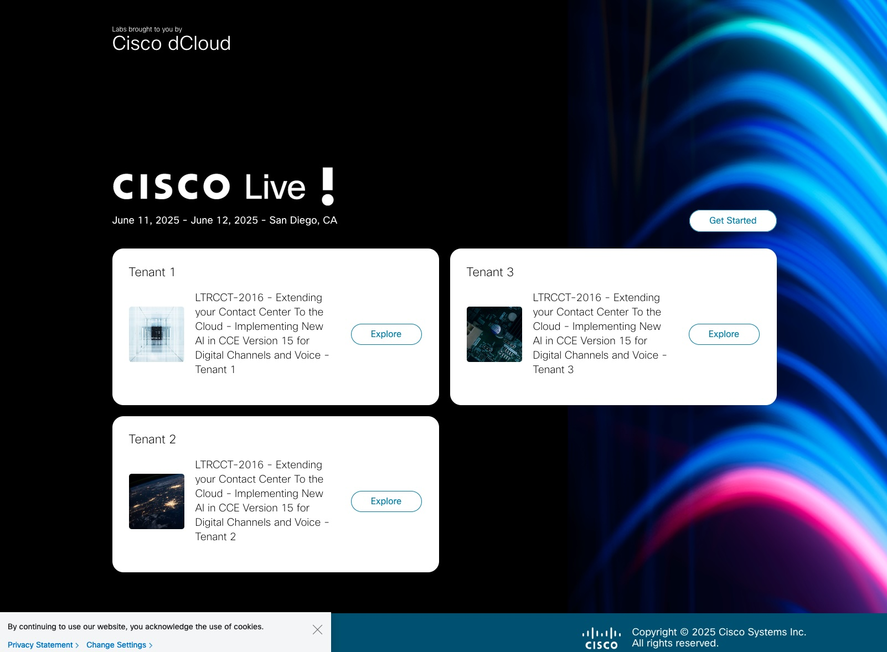
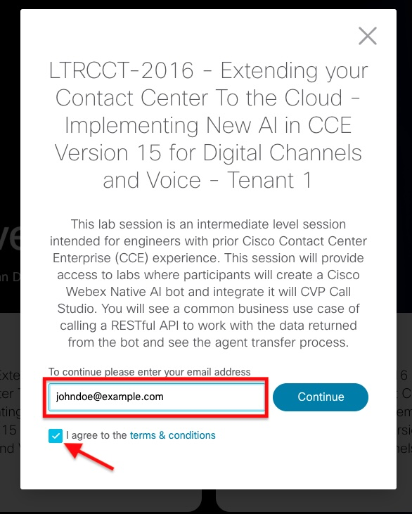
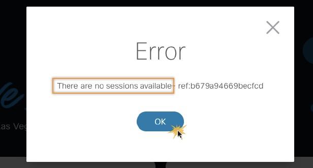
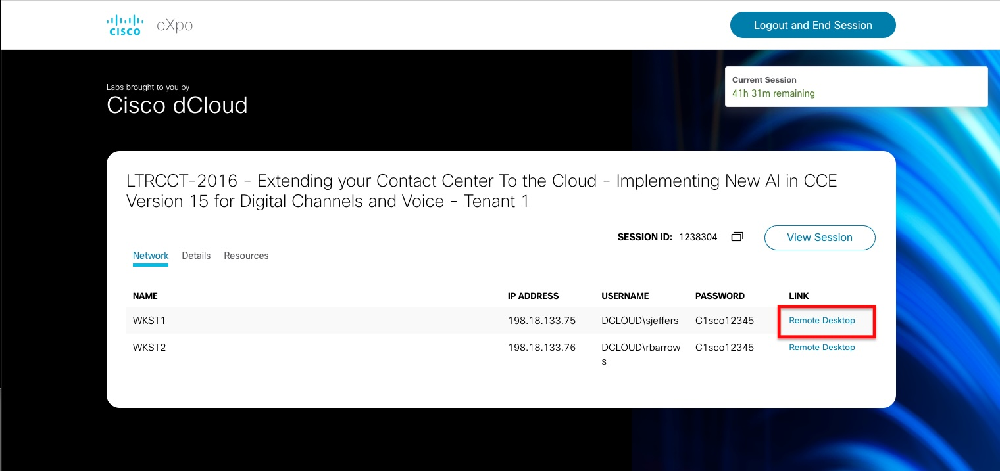

# Webex Tenant Access

We have 3 tenants that will be shared for this class. At your seat, you will see a note that indicates which tenant you will use for this class. Please refer to the table below for the login details.

| **Tenant Number** | **Username** | **Password** |
| --- | --- | --- |
| 1 | CiscoWxConnect2+tenant01@gmail.com | NativeAIWx1!! |

Note: The Webex Control Hub URL is always: [https://admin.webex.com](https://admin.webex.com){:target="_blank"}

# dCloud Access

We are using Cisco eXpo for this lab. The lab proctors have opened the eXpo page on each workstation before the class. If you do not see the eXpo start page shown in the image, please contact a proctor immediately.

1. We have assigned you to a tenant to use for this session. Please locate the tenant number for your seat (located on a note next to your workstation), then select the *Explore* button that corresponds to your tenant.

2. Enter your email, then check the box to accept the dCloud Terms & Conditions. When you have done this, select *Continue*.

    

3. If you click Continue and see this error, click OK and notify your Lab Proctor right away so we can assign you to a different tenant.

    

4. You are assigned a session. Select the *Remote Desktop* link next to WKST1 to open the jump box we will use for the entire lab.

    

# Lab Topology

This demonstration includes several VMs. Most of the servers are fully configurable using the administrative level account. Administrative account details are included in the steps where relevant and in the server details table. You should not need to type in the password for server logins at any point, but are listed if you do find a situation where they are required.

# Address and Credentials

| **Demo VMs** | **Hostname** | **IP Address** | **Username** | **Password** |
| --- | --- | --- | --- | --- |
| AD / Exchange | ad1 | 198.18.133.1 | DCLOUD\\Administrator | C1sco12345 |
| CUCM | cucm1 | 198.18.133.3 | administrator | C1sco12345 |
| Rogger | Ccerogger | 198.18.135.37 | DCLOUD\\Administrator | C1sco12345 |
| PG  | Ccecall | 198.18.133.12 | DCLOUD\\Administrator | C1sco12345 |
| AW-HDS | ccedata | 198.18.133.11 | DCLOUD\\Administrator | C1sco12345 |
| CVP Call Server CVP VXML Server | cvp1 | 198.18.133.13 | DCLOUD\\Administrator | C1sco12345 |
| CVP Reporting Server | cvprep1 | 198.18.133.70 | DCLOUD\\Administrator | C1sco12345 |
| Finesse | finesse1 | 198.18.133.16 | administrator | dCloud!23 |
| CUIC Live Data IdS | cuic1 | 198.18.133.15 | administrator | dCloud!23 |
| VVB | vvb1 | 198.18.133.143 | administrator | dCloud!23 |
| Cloud Connect | cloudconnect1 | 198.18.133.103 | administrator | C1sco12345 |
| Nuance Speech Suite | nuance1 | 198.18.135.126 | DCLOUD\\Administrator | C1sco12345 |
| Workstation 1 | wkst1 | 198.18.133.75 | DCLOUD\\sjeffers | C1sco12345 |
| Workstation 2 | wkst2 | 198.18.133.76 | DCLOUD\\rbarrows | C1sco12345 |
| vCube | cc-vcube | 198.18.133.226 | admin | C1sco12345 |

#

# Agent and User Information

|**User Name**|**Role**|**User ID**|**Password**|**Endpoint Devices**|**Extension**|
|---|---|---|---|---|---|
|Sandra Jefferson|Main Agent|sjeffers|C1sco12345|Workstation 1 Jabber|1080|
|Josh Peterson|CRM Agent|jopeters|C1sco12345|Workstation 1 Jabber|1080|
|Trudy Vere-Jones|CRM Agent|trujones|C1sco12345|Workstation 2 Jabber|1082|
|Owen Harvey|Outbound Agent|oharvey|C1sco12345|Workstation 1 Jabber|1080|
|Annika Hamilton|Outbound Agent|annika|C1sco12345|Workstation 2 Jabber|1082|
|Helen Laing|UWF Agent|hliang|C1sco12345|Workstation 1 Jabber|1080|
|Rick Barrows|Main Supervisor|rbarrows@dcloud.cisco.com|C1sco12345|Workstation 2 Jabber|1082|
|James Braksted|UWF Supervisor|jabrakcs@dcloud.cisco.com|C1sco12345|Workstation 2 Jabber|1082|
